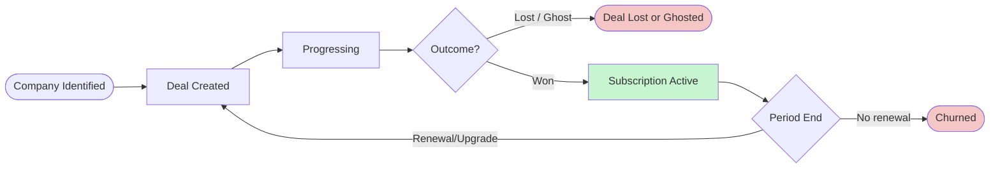
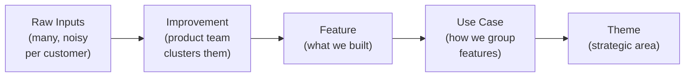

# Sales & Customer Lifecycle — Concept Doc

<!-- TOC -->

- [Overview](#overview)
- [Customer Lifecycle Flow](#customer-lifecycle-flow)
- [Use Case Narratives](#use-case-narratives)
  - [Sales Rep](#sales-rep-primary)
  - [Sales Manager](#sales-manager-primary)
  - [Product Team](#product-team-secondary--market-signals-tab)
  - [CS Rep](#cs-rep-secondary--relationship--customer-health-tabs)
- [Entity Overview](#entity-overview)
  - [Core — who does what, and what happens](#core--who-does-what-and-what-happens)
  - [Product Taxonomy — what the market is telling us](#product-taxonomy--what-the-market-is-telling-us)
- [How to Read This Dashboard](#how-to-read-this-dashboard)
  - [Role walkthroughs](#role-walkthroughs)
    - [Sales Rep — Monday morning (5 min)](#sales-rep--monday-morning-5-min)
    - [Sales Manager — Weekly review (15 min)](#sales-manager--weekly-review-15-min)
    - [Product Manager — Prioritization review (20 min)](#product-manager--prioritization-review-20-min)
    - [CS Rep — Account health check (10 min)](#cs-rep--account-health-check-10-min)
  - [The connected story — reading across tabs](#the-connected-story--reading-across-tabs)
- [Metrics — The Story](#metrics--the-story)
  - [Stage 1: FILL — Are we building a healthy pipeline?](#stage-1-fill--are-we-building-a-healthy-pipeline)
  - [Stage 2: CONVERT — Are we closing efficiently?](#stage-2-convert--are-we-closing-efficiently)
  - [Stage 3: UNDERSTAND — Why do we win or lose?](#stage-3-understand--why-do-we-win-or-lose)
  - [Stage 4: RETAIN — Are we keeping and growing customers?](#stage-4-retain--are-we-keeping-and-growing-customers)
- [Dashboard Tabs & Widgets](#dashboard-tabs--widgets)
  - [Tab 0: Overview](#tab-0-overview)
  - [Tab 1: Pipeline](#tab-1-pipeline)
  - [Tab 2: Performance](#tab-2-performance)
  - [Tab 3: Market Signals](#tab-3-market-signals)
  - [Tab 4: Relationship](#tab-4-relationship)
  - [Tab 5: Customer Health](#tab-5-customer-health)

<!-- /TOC -->

---

## Overview

Every deal tells a story — and this dashboard reads them all.

A prospect becomes a customer through a series of calls, signals, and decisions. At each step, we're learning: what they need, what they're comparing us to, what's blocking the deal, and what makes us win. After they sign, the story continues — are they engaged, healthy, and growing with us, or quietly drifting toward churn?

This dashboard tracks that full arc. It starts with the pipeline: what deals are active, who owns them, and what needs attention today. It digs into performance: where are we winning, where are we leaking, and why. It surfaces market signals: what are customers asking for, which product gaps keep costing us deals, and what competitors keep showing up. And it closes the loop post-sale: are customers staying engaged, and are we catching the early signs before someone churns.

The data is the same across all views — calls, raw inputs, deals, subscriptions. The dashboard just surfaces the right angle depending on what question you're trying to answer.

**Primary users:** Sales reps · Sales managers
**Secondary users:** Product team (Market Signals tab) · CS reps (Relationship & Health tabs) · BizOps / Revenue

**Dashboard:** 6 tabs — Overview · Pipeline · Performance · Market Signals · Relationship · Customer Health

---

## Customer Lifecycle Flow


---

## Use Case Narratives

This dashboard is built primarily for the **Sales team**. Product and CS are secondary consumers with dedicated tabs.

### Sales Rep *(primary)*

The sales rep needs to:

1. **Monitor their active pipeline** — what's new, what's ongoing, what's been ghosted (no activity in 45+ days), and what needs action today
2. **Understand capacity** — how many deals each rep owns, calls per week per rep, whether anyone is overloaded or underutilized
3. **Track their own deal responsibilities** — who the contacts are, what was discussed, what raw inputs were logged, what's the call schedule
4. **Know why deals are lost** — missing feature, pricing friction, competitor win, or ghosted — so they can adjust approach

### Sales Manager *(primary)*

The sales manager needs to:

1. **See team pipeline and performance** — funnel conversion rates, avg time per stage, win rate vs. target, ghost rate
2. **Identify coaching opportunities** — which rep has low conversion at a specific stage, whose deals are stalling
3. **Understand systematic blockers** — which lost reasons dominate, which competitors consistently hurt win rate

### Product Team *(secondary — Market Signals tab)*

The product team uses the Market Signals tab to:

1. **See aggregated market signals** — which improvements come up most, which are blocking deals vs. nice-to-haves
2. **Understand competitor context** — which competitors are mentioned, in which deals, and whether their presence correlates with losses
3. **Track improvement status** — which customer problems are open, in progress, shipped, or have a workaround — and close the loop with reps when something ships
4. **Correlate signals with outcomes** — which unmet asks appear in lost deals vs. won deals

### CS Rep *(secondary — Relationship & Customer Health tabs)*

After a deal closes, the CS rep uses the Relationship tab to:

1. **See deal context inherited from sales** — what was promised, what the customer's concerns were, what competitors they evaluated
2. **Monitor relationship health** — who hasn't been contacted recently, who's raising issues, who's going quiet
3. **Track renewal and churn signals** — plan changes, satisfaction indicators, whether customers are extending or at risk

---

## Entity Overview

10 conceptual entities across two groups. See [schema.md](schema.md) for full field definitions and enum values.

### Core — who does what, and what happens

| Entity | Purpose |
|---|---|
| `Company` | Any organization in the system — Holistics, prospects, customers, and competitors — in one table |
| `Person` | Any individual — internal reps and external contacts — in one table |
| `Deal` | A commercial engagement from first contact to won, lost, or churned. Stage history is part of Deal, not a separate entity. |
| `Call` | Any touchpoint between Holistics and a company, pre- or post-sale. Who attended is a relationship of Call, not a separate entity. |
| `Raw Input` | Any signal from a customer — logged by a rep during a call, or raised by the customer via a ticket. Unified regardless of channel. |
| `Subscription` | The active billing state that results from a won deal. Runs until the customer churns or a new deal replaces it. |

### Product Taxonomy — what the market is telling us

| Entity | Purpose |
|---|---|
| `Theme` | Top-level strategic area (e.g. Collaboration, Data Governance, Reporting Speed) |
| `Use Case` | How the product team groups customer needs within a theme (e.g. External sharing, Column-level access) |
| `Feature` | What's actually built in the app. Has its own lifecycle status. Belongs to a use case. |
| `Improvement` | The product team's synthesis of multiple raw inputs into one coherent customer problem, with specific requirements documented. Bridges raw inputs to features. |

**How the product taxonomy connects:**



An Improvement can link to an existing Feature (as a sub-need or enhancement) or be unlinked (new territory, no feature yet). Many raw inputs cluster into one Improvement. When a Feature ships, all linked Improvements with open status can be flagged for rep follow-up.

---

## Metrics — The Story

Metrics form a causal chain. When something goes wrong, follow the chain to diagnose why.

```
FILL → CONVERT → UNDERSTAND → RETAIN
```

**Example:** Win rate drops → Stage conversion shows drop at Validating → Market Signals shows "SSO" is top blocker in lost deals → Product ships SSO → Promise tracker notifies rep → Rep follows up with lost prospects.

---

### Stage 1: FILL — Are we building a healthy pipeline?

| Metric | What it tells you | How to calculate |
|---|---|---|
| Active pipeline value | Total deal value in progress — is there enough? | `SUM(deal_value_usd) WHERE status = 'in_progress'` |
| Ghost rate | % of open deals with no activity in 45+ days | `COUNT(deals where last_activity < today - 45) / COUNT(open deals)` |
| Open deals per rep | Load vs. capacity target — overloaded reps let deals stall | `COUNT(deals WHERE status = 'in_progress') GROUP BY owner_id` |
| New deals this period | Are we adding enough top-of-funnel? | `COUNT(deals WHERE created_at >= period_start)` |

---

### Stage 2: CONVERT — Are we closing efficiently?

| Metric | What it tells you | How to calculate |
|---|---|---|
| Win rate | The headline outcome metric | `COUNT(status='won') / COUNT(status IN ('won','lost'))` |
| Avg sales cycle | How long deals take — by outcome | `AVG(closed_at - created_at) GROUP BY status` |
| Stage conversion funnel | Where deals drop off — the exact leaking stage | `COUNT(deals reaching stage N+1) / COUNT(deals that entered stage N)` per stage pair |
| Avg time per stage | Where deals slow down even if they don't drop | `AVG(COALESCE(exited_at, today()) - entered_at) GROUP BY stage` via `deal_stage_history` |
| Lost reason breakdown | Why we lose — flag if any one reason > 40% | `COUNT(*) / SUM(COUNT(*)) OVER () FROM deals WHERE status='lost' GROUP BY lost_reason` |

---

### Stage 3: UNDERSTAND — Why do we win or lose?

| Metric | What it tells you | How to calculate |
|---|---|---|
| Competitor displacement rate | Which competitors hurt our win rate most | `WIN_RATE(deals with competitor X mentioned) - WIN_RATE(deals without)` per competitor |
| Top improvements by deal count | Which customer problems come up most — roadmap priority | `COUNT(DISTINCT deal_id) FROM raw_inputs GROUP BY improvement_id ORDER BY count DESC` |
| Blocking improvements in lost deals | Which unmet improvements appear most in losses | `COUNT(deals WHERE status='lost') per improvement WHERE is_blocking = true` |
| Trial feedback vs. outcome | Does evaluation help or hurt? What do prospects hit? | `raw_inputs WHERE call_type = 'evaluation'` grouped by deal outcome |

---

### Stage 4: RETAIN — Are we keeping and growing customers?

| Metric | What it tells you | How to calculate |
|---|---|---|
| Net Revenue Retention (NRR) | Revenue retained + expanded — >100% = growing from existing base | `(starting_mrr + expansion - contraction - churn) / starting_mrr × 100` per month |
| MRR churn rate | % of revenue lost to churn each month | `SUM(mrr_usd of churned subscriptions in month M) / starting_mrr_M` |
| At-risk composite flag | Early warning before churn happens | Boolean: `no contact 90d AND no upgrade 6mo AND 2+ open issues` |
| Engagement rate | Calls + raw inputs per customer per month — very high or very low both signal risk | `(COUNT(calls) + COUNT(raw_inputs)) / active_months GROUP BY company_id` |
| Time to first CS touch | Days from subscription start to first post-sale call — long lag = delayed value | `MIN(call_date WHERE phase='post_sale') - subscriptions.started_at` per company |


---

## Dashboard Tabs & Widgets

Each tab answers a specific business question. Tabs form a connected story — start at **Overview** for the full picture, then drill into specialist tabs to investigate what's driving the numbers.

---

### Tab 0: Overview
**Primary user:** Anyone — exec, manager, rep, CS rep
**Key question:** How are we doing overall, and what needs attention right now?
**Filters:** Date range · Deal type (new business / renewal / expansion)

The home tab. Shows the most critical signals across all areas in one view before drilling into specialist tabs.

| Widget | Type | Description |
|---|---|---|
| Active pipeline value | KPI card | Total value of open deals — is there enough in the funnel? |
| Win rate vs. target | KPI card | Current period win rate vs. team target + prior period comparison |
| Total MRR | KPI card | Active subscription revenue — with month-over-month change |
| At-risk customers | KPI card | Count of accounts flagged by composite health signal |
| Needs attention | Alert list | Combined: ghost deals + customers going dark + overdue check-ins — sorted by urgency |
| Pipeline snapshot | Funnel chart | Active deals by stage — count + total value per stage |
| Customer health summary | Donut / bar | Active customers split by health status: healthy / at-risk / disengaged |
| Top blocking improvements | List | Improvements flagged `is_blocking = true` across active deals — product team's most urgent view |
| Shipped → follow up | List | Features recently shipped that customers had requested — reps to close the loop |

---

### Tab 1: Pipeline
**Primary user:** Sales rep (personal view) · Sales manager (team view)
**Key question:** What's active, what's stuck, and what needs action today?
**Filters:** Sales rep · Company · Deal stage · Deal type (new business / renewal / expansion)

| Widget | Type | Description |
|---|---|---|
| Active deals by stage | Funnel / bar chart | Count + total value of open deals per stage |
| Ghost deals alert | Alert list | Deals with no call or stage change in 45+ days, sorted by days idle |
| Deals stuck in stage | Alert list | Open deals where `today() - stage_entered_at > 14 days` |
| Active deals table | Data table | Company · stage · owner · deal value · days in current stage · last activity date · "needs attention" flag |
| Open deals per rep | Bar chart | Count of open deals per rep vs. target — highlights overload |
| Calls per rep this week | Bar chart | Calls conducted this week per rep vs. weekly target |
| New deals this month | KPI card | Count + value of deals created in current month vs. prior month |
| Upcoming calls | List | Next 7 days of scheduled calls — company, rep, call type |

---

### Tab 2: Performance
**Primary user:** Sales manager · BizOps
**Key question:** Are we hitting targets, and where is the pipeline leaking?
**Filters:** Date range · Sales rep · Deal type · Company size tier (SMB / Mid-Market / Enterprise)

| Widget | Type | Description |
|---|---|---|
| Win rate | KPI card | Won / (won + lost) — current period vs. target and prior period |
| Avg sales cycle (won) | KPI card | Avg days from deal created to closed for won deals |
| Avg sales cycle (lost) | KPI card | Avg days for lost deals — long cycles with losses = wasted effort |
| Stage conversion funnel | Waterfall / funnel | % of deals that advanced from each stage to the next |
| Avg time per stage | Horizontal bar chart | Avg days spent in each stage — reveals where deals stall |
| Lost reason breakdown | Bar chart | Distribution of `lost_reason` across all lost deals — flag if top reason > 40% |
| Deal outcome by rep | Grouped bar | Win rate per rep — for coaching conversations |
| Deals closed this quarter | KPI card | Won + lost count and value vs. quarter target |
| Ghost rate trend | Line chart | % of open deals ghosted over time — rising = pipeline health deteriorating |

---

### Tab 3: Market Signals
**Primary user:** Product team · Sales manager
**Key question:** What are customers telling us about our product, competitors, and gaps?
**Filters:** Date range · Deal outcome (won / lost / in progress) · Company size tier · Theme · Competitor

| Widget | Type | Description |
|---|---|---|
| Top improvements | Bar chart | Improvements ranked by number of linked raw inputs — highest volume = most common customer problem |
| Improvements: won vs. lost | Grouped bar | Same improvements, split by deal outcome — highlights which gaps cost us deals |
| Blocking improvements | Table | Improvements with `is_blocking = true` across active deals — sorted by frequency |
| Competitor mentions | Bar chart | Which competitors come up most, by deal count |
| Competitor displacement rate | Table | Win rate when each competitor is mentioned vs. when they're not — negative delta = competitor hurts us |
| Pricing & concern signals | KPI + breakdown | Raw inputs with `input_type = concern` — segmented by company size tier |
| Trial feedback | List / table | Raw inputs from evaluation calls — what prospects observe during trial, linked to deal outcome |
| Promise tracker | Status table | Open improvements per customer with status (open / planned / shipped / workaround) — sales-to-product closed loop |

---

### Tab 4: Relationship
**Primary user:** CS rep
**Key question:** Which customers need a check-in, and who's going quiet?
**Filters:** CS rep (account owner) · Company · Plan tier · Health status

| Widget | Type | Description |
|---|---|---|
| Accounts going dark | Alert list | Customers with no call or raw input in 60+ days — sorted by days since last touch |
| Overdue check-ins | Alert list | Accounts where last post-sale call > 30 days — based on monthly cadence target |
| My accounts overview | Data table | Company · plan · MRR · last contact date · open inputs · health flag |
| Open issues | Table | Unresolved raw inputs (concerns, bugs, questions) by company — with age and priority |
| Upcoming check-in calls | List | Scheduled post-sale calls next 14 days |
| Deal context panel | Detail view | Per customer: improvements raised in pre-sale, competitors evaluated, what was promised — inherited from sales |
| Recent signals | Feed | Latest raw inputs from post-sale calls — new improvements, concerns, positive signals |

---

### Tab 5: Customer Health
**Primary user:** CS manager · Revenue / BizOps
**Key question:** How is retention trending, and which accounts are at risk?
**Filters:** Date range · Plan tier · Company size tier · Health status (healthy / at-risk / disengaged)

| Widget | Type | Description |
|---|---|---|
| Active subscriptions | KPI card | Count of active customers + total MRR |
| MRR trend | Line chart | Monthly MRR over time — total, new, expansion, churned |
| Churn rate (MRR) | KPI card | % of MRR lost to churn in current month vs. prior months |
| Net Revenue Retention (NRR) | KPI card | (starting MRR + expansion − contraction − churn) / starting MRR × 100 |
| At-risk accounts | Alert table | Companies flagged by composite signal: no contact 90d + no upgrade 6mo + 2+ open issues |
| Subscription changes | Table | Recent upgrades, downgrades, churns — with deal value and reason |
| Avg tenure by plan tier | Bar chart | How long customers stay on each plan — rising = stickiness improving |
| Engagement rate | Scatter / heatmap | Calls + raw inputs per customer per month — very high or very low both signal risk |
| Time to first CS touch | KPI card | Days from subscription start to first post-sale call — target < 7 days |

---

## How to Read This Dashboard

The dashboard is organized as a **drill-down story**, not a collection of independent reports. Each tab answers one question and hands off to the next when you need to go deeper.

```
Overview → "Something's wrong"
  ↓
Pipeline → "Where exactly is the problem?"
  ↓
Performance → "How bad is it, and what's the pattern?"
  ↓
Market Signals → "Why is it happening?"
  ↓
Relationship / Customer Health → "Who's at risk right now?"
```

---

### Role walkthroughs

#### Sales Rep — Monday morning (5 min)

> *"Where do I spend my time this week?"*

1. Open **Overview** → Look at **Needs Attention** first. This is your to-do list: ghost deals, overdue check-ins, deals stuck in the same stage for 14+ days.
2. Click into **Pipeline** → Find your name in the **Active deals table**. Sort by *Days in stage* — anything over 14 days in Validating or Progressing needs action today.
3. Check **Ghost deals alert** — any deal with no call or update in 45+ days. These are silently dying. The flag `follow_up_at` tells you if the prospect asked to be contacted again on a specific date — check if that date has passed.
4. Look at **Upcoming calls** — confirm your call schedule for the week. If a discovery call is on the list, expect to log 20–40 raw inputs after it (product signals, competitor mentions, concerns).

**Key number to watch:** *Days in current stage* in the active deals table. A deal stuck in Validating for 3+ weeks almost always has an unresolved blocker — check its raw inputs for `deal_breaker` flags.

---

#### Sales Manager — Weekly review (15 min)

> *"Is the team on track, and where do I need to intervene?"*

1. **Overview** → Check **Win rate vs. target** and **Active pipeline value**. If win rate is down and pipeline value is flat, you have a systemic conversion problem — not just a slow week.
2. **Performance → Stage conversion funnel** — find the stage where deals are dropping. If 60 deals entered Validating but only 30 moved to Progressing, that's a 50% drop. That's your coaching focus.
3. **Performance → Deal outcome by rep** — compare win rates across reps. If one rep is at 28% while another is at 55%, it's not random — look at their stage conversion breakdown individually.
4. **Performance → Lost reason breakdown** — if `missing_feature` is above 40% of losses, that's a product conversation, not a sales problem. Bring the data to Market Signals.
5. **Pipeline → Open deals per rep** — check for overload. A rep with 15+ open deals is likely letting deals go dark. Ghost rate and rep workload move together.

**Key number to watch:** *Stage conversion funnel* — specifically the Validating → Progressing rate. This is where most deals die in this data. A drop here usually means prospects aren't convinced during evaluation calls.

---

#### Product Manager — Prioritization review (20 min)

> *"What should we build next, and does it actually affect deals?"*

1. **Market Signals → Blocking improvements** — these are product gaps with `is_blocking = true` on active deals. Each row is a live deal you could potentially save. Sort by company count, not raw input count (1 company mentioning SSO 10 times is less urgent than 8 companies mentioning it once each).
2. **Market Signals → Improvements: won vs. lost** — compare the same improvement across deal outcomes. If "Excel export" shows up in 18 lost deals but only 4 won deals, it's a deal-differentiator. If it's evenly spread, it's a nice-to-have.
3. **Market Signals → Competitor displacement rate** — which competitors correlate with lower win rates. If Metabase is mentioned in 30 deals and your win rate drops by 20% when they appear, that's a competitive gap — look at which improvements come up in those Metabase deals.
4. **Promise tracker** — when a feature ships, this is your follow-up list. Any customer who raised a now-shipped improvement should be contacted. This closes the loop from product → sales → customer.

**Key number to watch:** *Company count* on blocking improvements. 1 company with 14 raw inputs is a loud customer. 9 companies with 1–2 inputs each is a real pattern.

---

#### CS Rep — Account health check (10 min)

> *"Which of my customers needs attention before they go quiet?"*

1. **Relationship → Accounts going dark** — customers with no call or signal in 60+ days. Sorted by days since last touch. These are your most urgent accounts.
2. **Relationship → Open issues** — unresolved raw inputs (bugs, concerns, how-to questions) per customer. An account with 3+ unresolved issues and no recent call is a churn signal.
3. **Relationship → Deal context panel** — before calling a customer, check what was promised during the sales process. What improvements did they raise? What competitors did they evaluate? This is your preparation context.
4. **Customer Health → At-risk accounts** — the composite flag: no contact in 90 days + same or lower plan for 6+ months + 2+ open issues. All three together = churn risk.
5. **Customer Health → Time to first CS touch** — if this is > 7 days for any account, they may have had a rough start. Check their raw inputs for onboarding issues.

**Key number to watch:** *Days since last touch* in the Accounts going dark list. 60 days is the alert threshold. 90+ days means the relationship may already be damaged.

---

### The connected story — reading across tabs

The tabs aren't independent views. They're a diagnostic chain. Here's an example:

**Scenario: Win rate dropped from 48% to 31% this quarter.**

| Step | Where to look | What you find |
|---|---|---|
| 1. Confirm it's real | Overview → Win rate KPI | 31% this quarter vs. 48% last quarter — confirmed |
| 2. Find the drop-off stage | Performance → Stage conversion funnel | 50% drop from Validating → Progressing (was 70% last quarter) |
| 3. Find the pattern in losses | Performance → Lost reason breakdown | `missing_feature` jumped from 28% to 47% of losses |
| 4. Find which feature | Market Signals → Blocking improvements | "Enterprise SSO via SAML" — 9 companies, `is_blocking = true`, status: `planned` |
| 5. Confirm competitor link | Market Signals → Competitor displacement rate | Deals with Okta/SAML-first competitors: win rate 18% vs. 44% without |
| 6. Check who's affected | Relationship → Deal context panel (per company) | 4 active deals with "SSO required" in raw inputs, at Validating stage |
| 7. Close the loop | Promise tracker (after SAML ships) | Follow up with those 4 companies + any lost deals that cited it |

This is the intended flow. No single tab tells the full story — they're meant to be used together.