# Sales Dashboard — Schema Reference

<!-- TOC -->

- [Entity Relationships](#entity-relationships)
  - [Diagram](#diagram)
  - [Relationship Table](#relationship-table)
- [Core Entities](#core-entities)
  - [`companies`](#companies)
  - [`persons`](#persons)
  - [`calls`](#calls)
  - [`raw_inputs`](#raw_inputs)
  - [`deals`](#deals)
  - [`subscriptions`](#subscriptions)
- [Product Taxonomy Entities](#product-taxonomy-entities)
  - [`themes`](#themes)
  - [`use_cases`](#use_cases)
  - [`features`](#features)
  - [`improvements`](#improvements)
- [Metrics](#metrics)
  - [Stage 1: FILL — Are we building a healthy pipeline?](#stage-1-fill--are-we-building-a-healthy-pipeline)
  - [Stage 2: CONVERT — Are we closing efficiently?](#stage-2-convert--are-we-closing-efficiently)
  - [Stage 3: UNDERSTAND — Why do we win or lose?](#stage-3-understand--why-do-we-win-or-lose)
  - [Stage 4: RETAIN — Are we keeping and growing customers?](#stage-4-retain--are-we-keeping-and-growing-customers)
- [Dataset Design — Holistics](#dataset-design--holistics)
  - [Dataset 1: Sales Pipeline](#dataset-1-sales-pipeline)
  - [Dataset 2: Market Signals](#dataset-2-market-signals)
  - [Dataset 3: Relationship & Health](#dataset-3-relationship--health)

<!-- /TOC -->

---

Field-level definitions for all entities. Physical implementation tables (e.g. `deal_stage_history`, `call_attendees`) are noted within their parent entity. Enum values are defined inline under each field.

---

## Entity Relationships

### Diagram

```mermaid
erDiagram
    %% --- Core: people & companies ---
    companies ||--o{ persons       : "has"
    companies ||--o{ deals         : "has"
    companies ||--o{ subscriptions : "has"

    %% --- Sales motion ---
    persons   ||--o{ deals         : "owns (AE)"
    deals     ||--o| subscriptions : "creates"
    deals     |o--o| deals         : "previous_deal"

    %% --- Interactions ---
    companies ||--o{ calls         : "has"
    deals     |o--o{ calls         : "has"
    calls     }o--o{ persons       : "attended by"

    %% --- Signals ---
    companies ||--o{ raw_inputs    : "has"
    calls     |o--o{ raw_inputs    : "captures"
    improvements |o--o{ raw_inputs : "groups"

    %% --- Product taxonomy ---
    themes    ||--o{ use_cases     : "has"
    use_cases ||--o{ features      : "has"
    features  |o--o{ improvements  : "addressed by"
```



> `||` = exactly one · `o|` = zero or one · `|{` = one or many · `o{` = zero or many

---

### Relationship Table

| From | → To | FK field | Nullable | Notes |
|---|---|---|---|---|
| `companies` | `persons` | `persons.company_id` | No | |
| `companies` | `deals` | `deals.company_id` | No | |
| `companies` | `calls` | `calls.company_id` | No | Denormalized — avoids joining through deal |
| `companies` | `raw_inputs` | `raw_inputs.company_id` | No | Denormalized — avoids joining through call |
| `companies` | `subscriptions` | `subscriptions.company_id` | No | |
| `persons` | `deals` | `deals.owner_id` | No | The AE who owns the deal |
| `calls` ↔ `persons` | `call_attendees` | junction table | — | Many-to-many; `role` field distinguishes host from attendee |
| `deals` | `calls` | `calls.deal_id` | Yes | Null for post-sale calls not tied to a deal |
| `deals` | `subscriptions` | `subscriptions.deal_id` | No | |
| `deals` | `deals` | `deals.previous_deal_id` | Yes | Self-referential — renewal/expansion chain |
| `calls` | `raw_inputs` | `raw_inputs.call_id` | Yes | Null for ticket/email inputs with no call |
| `improvements` | `raw_inputs` | `raw_inputs.improvement_id` | Yes | Null = not yet triaged by product team |
| `features` | `improvements` | `improvements.feature_id` | Yes | Null = no feature built yet |
| `themes` | `use_cases` | `use_cases.theme_id` | No | |
| `use_cases` | `features` | `features.use_case_id` | No | |

---

> **⚠️ Dataset path ambiguity:** Four join collisions exist because `company_id` is denormalized across multiple tables, and some models have both a direct FK to `companies` and a transitive path via another model. When building the Holistics dataset, register only the **direct** path listed below — do not define relationships that would create the transitive chain. See [Holistics path ambiguity docs](https://docs.holistics.io/docs/dataset-path-ambiguity).
>
> | Collision | Register this (direct) | Omit this (transitive) |
> |---|---|---|
> | `raw_inputs` → `companies` (customer) | `raw_inputs.company_id` | `raw_inputs → calls → companies` |
> | `raw_inputs` → `companies` (competitor) | Register as a **second, aliased** relationship: `raw_inputs.competitor_id` → `companies`, alias the relationship `competitor_company` in the dataset. Do not let Holistics auto-join this via the `company_id` path. | n/a — two distinct FKs to the same table; alias prevents ambiguity |
> | `calls` → `companies` | `calls.company_id` | `calls → deals → companies` |
> | `subscriptions` → `companies` | `subscriptions.company_id` | `subscriptions → deals → companies` |
> | `persons` → `companies` | `persons.company_id` | `persons → deals → companies` |

---

## Core Entities

---

## `companies`

Every organization in the system — Holistics itself, prospects, customers, and competitors — in one table.

| Field | Type | Nullable | Description |
|---|---|---|---|
| `id` | uuid | No | Primary key |
| `name` | varchar | No | Organization name |
| `type` | enum | No | Role this company plays — see values below |
| `industry` | varchar | Yes | e.g. "E-commerce", "Fintech", "Logistics" |
| `country` | varchar | Yes | HQ country |
| `employee_count` | integer | Yes | Headcount — used for SMB / Mid-Market / Enterprise segmentation |
| `website` | varchar | Yes | Company domain |
| `logo_url` | varchar | Yes | URL to company logo image — used for display in dashboard widgets. Use `https://logo.clearbit.com/{domain}` format for real companies. |
| `created_at` | timestamp | No | When the record was created |

**`type` values:**

| Value | When used |
|---|---|
| `internal` | Holistics — single internal record |
| `prospect` | A company being pursued, pre-deal-won |
| `customer` | A company with an active or past subscription |
| `competitor` | Referenced in `raw_inputs.competitor_id`; not a deal participant |

> A prospect becomes a customer when a deal is won. Competitors are never prospects or customers. Company status (active customer, churned, in-negotiation) is derived from the most recent deal: `SELECT DISTINCT ON (company_id) status FROM deals ORDER BY company_id, created_at DESC`.

---

## `persons`

Every individual — internal reps and external contacts — in one table.

| Field | Type | Nullable | Description |
|---|---|---|---|
| `id` | uuid | No | Primary key |
| `company_id` | uuid | No | FK → `companies.id` — determines internal vs external: if the company's `type = 'internal'`, this person is a Holistics employee |
| `name` | varchar | No | Full name |
| `email` | varchar | Yes | Work email |
| `role` | enum | No | What this person does — see values below |
| `created_at` | timestamp | No | When the record was created |
| `left_at` | timestamp | Yes | When this person left their company. Null = still active. For internal persons, marks when a Holistics employee left. Used to model team turnover over the 4-year history. |

**`role` values:**

| Value | Internal / External | What they do |
|---|---|---|
| `ae` | Internal | Account Executive — owns and closes deals |
| `cs_rep` | Internal | Customer Success rep — manages post-sale relationship |
| `sdr` | Internal | Sales Development Rep — generates and qualifies leads |
| `manager` | Internal | Sales or CS manager — team oversight |
| `bizops` | Internal | Business Operations — reporting, targets, process |
| `product` | Internal | Product Manager — joins calls for discovery and technical discussions |
| `data_analyst` | Internal | Data Analyst — attends calls on data-heavy evaluations |
| `ceo` | Internal | CEO — joins calls for strategic or enterprise-level deals |
| `cto` | Internal | CTO — joins calls for technically complex evaluations |
| `champion` | External | Internal advocate at the prospect/customer who pushes for us |
| `decision_maker` | External | The person who approves and signs the deal |
| `evaluator` | External | Technical evaluator — tests the product, assesses fit |
| `end_user` | External | Will use the product day-to-day; may influence evaluation |

---

## `calls`

Every interaction between Holistics and a company, pre- or post-sale.

**Physical note:** Attendees are stored in a `call_attendees` junction table (`call_id`, `person_id`, `role`). `role` is an enum: `host` (the rep who led the call) · `attendee` (everyone else). A call must have exactly one `host`. This is a relationship of Call, not a separate entity.

| Field | Type | Nullable | Description |
|---|---|---|---|
| `id` | uuid | No | Primary key |
| `company_id` | uuid | No | FK → `companies.id` — the company this call is about |
| `deal_id` | uuid | Yes | FK → `deals.id` — null for post-sale calls not tied to a deal |
| `call_date` | date | No | Date the call took place |
| `duration_min` | integer | Yes | Duration in minutes |
| `phase` | enum | No | Where in the lifecycle this call falls |
| `type` | enum | No | What kind of call this was |
| `notes` | text | Yes | Free-text summary — display only, not used in metrics |

**`phase` values:**

| Value | When |
|---|---|
| `pre_sale` | During the sales process, before a deal is won |
| `post_sale` | After the deal is won — onboarding, check-ins, renewals |

**`type` values:**

| Value | Description |
|---|---|
| `discovery` | First call — understand the prospect's context and needs |
| `demo` | Product walkthrough |
| `evaluation` | Deep technical or use-case review during trial |
| `negotiation` | Pricing, terms, and contract discussion |
| `onboarding` | First post-sale call to get the customer set up |
| `check_in` | Periodic relationship call with an existing customer |
| `renewal` | Discussion about renewing or expanding the subscription |

---

## `raw_inputs`

Any signal from a customer — unified regardless of channel. Covers what a rep logs during a call, what a customer raises as a support ticket, or any other inbound feedback.

**Physical note:** This replaces the previous separation of `call_signals` and `support_tickets`. Channel and direction differentiate them instead of separate tables.

| Field | Type | Nullable | Description |
|---|---|---|---|
| `id` | uuid | No | Primary key |
| `company_id` | uuid | No | FK → `companies.id` — denormalized for direct company-level queries |
| `call_id` | uuid | Yes | FK → `calls.id` — the call where this input was captured. Null for customer-initiated inputs (tickets) |
| `improvement_id` | uuid | Yes | FK → `improvements.id` — the improvement this input belongs to. Null = not yet triaged by product |
| `competitor_id` | uuid | Yes | FK → `companies.id` where `type = competitor` — only for `competitor_mention` type |
| `input_type` | enum | No | What kind of signal this is — see values below |
| `source` | enum | No | How this input arrived — see values below |
| `direction` | enum | No | Who initiated — us (rep logged it) or them (customer raised it) |
| `is_blocking` | boolean | No | `true` = this signal is a hard blocker for the deal or relationship. Any type can be blocking. |
| `priority` | enum | Yes | Urgency — primarily used for customer-initiated inputs (tickets) |
| `status` | enum | Yes | Resolution state — primarily used for customer-initiated inputs (tickets) |
| `description` | text | Yes | Free-text detail of what was said or observed |
| `resolved_at` | timestamp | Yes | When the input was resolved. Null = still open. |
| `created_at` | timestamp | No | When the input was logged |

**`input_type` values:**

| Value | When to use | Example |
|---|---|---|
| `feature_request` | Customer wants a specific capability we don't have | "We need Excel export", "We want row-level permissions" |
| `deal_breaker` | A hard blocker — missing this will kill the deal or renewal | "Must have SSO via SAML or we can't proceed" |
| `ui_ux` | Feedback about the interface, usability, or user experience | "The filter panel is confusing", "Too many clicks to build a report" |
| `onboarding_issue` | Friction during initial setup or onboarding | "Couldn't connect to our warehouse on day one" |
| `testimonial` | Strong positive endorsement — usable in sales or marketing | "This replaced three tools for us" |
| `excitement` | Genuine enthusiasm about a feature or use case | "The modeling layer is exactly what we were looking for" |
| `performance` | Latency, query speed, or load time concern | "Dashboard takes 30 seconds to load" |
| `irrelevant` | Off-topic or logged in error | "They asked about a completely different product" |
| `permission` | Access control, security, or data governance need | "We need column-level masking for PII fields" |
| `feedback` | General product feedback that doesn't fit another type | "Overall happy, a few rough edges" |
| `how_to` | Customer needs help understanding how to do something | "How do we set up row-level security?" |
| `bug` | Something is broken or behaving unexpectedly | "Dashboard not loading after data refresh" |

> **Note on competitor tracking:** competitor mentions are captured via `raw_inputs.competitor_id` (FK → `companies` where `type = competitor`), not as an `input_type`. Any input type can have a `competitor_id` if a competitor was referenced in the same signal.

**`source` values:**

| Value | When |
|---|---|
| `call` | Captured during a structured call — rep logged it |
| `ticket` | Customer raised it through a support channel |
| `email` | Captured from email communication |
| `other` | Any other channel |

**`direction` values:**

| Value | Meaning |
|---|---|
| `outbound` | Rep observed or logged it — we initiated the capture |
| `inbound` | Customer reached out — they initiated |

**`priority` values** — primarily used when `source = ticket`:
`low` · `medium` · `high` · `critical`

**`status` values:**

| Value | Description |
|---|---|
| `new` | Just logged — not yet reviewed |
| `need_inputs` | Needs more information before it can be analyzed |
| `valid` | Analyzed and confirmed as a real signal |
| `solved` | The issue or request has been resolved |
| `informed` | Customer has been notified about a workaround or a feature that shipped |
| `has_workaround` | No native solution, but a workaround has been documented |
| `not_relevant` | Reviewed and determined out of scope or not actionable |
| `duplicated` | Already tracked under another raw input |

---

## `deals`

A commercial engagement — from first discussion to won, lost, or churned.

**Physical note:** Stage history is stored in a `deal_stage_history` snapshot table (`deal_id`, `stage`, `entered_at`, `exited_at`). This is the history of Deal, not a separate entity. `exited_at = NULL` means the deal is currently in that stage. Time-in-stage = `COALESCE(exited_at, today()) - entered_at`.

| Field | Type | Nullable | Description |
|---|---|---|---|
| `id` | uuid | No | Primary key |
| `company_id` | uuid | No | FK → `companies.id` |
| `owner_id` | uuid | No | FK → `persons.id` — the AE responsible for this deal |
| `deal_type` | enum | No | What kind of commercial motion this is |
| `status` | enum | No | Current state of the deal |
| `stage` | enum | Yes | Current sales stage — only relevant when `status = in_progress` |
| `deal_value_usd` | integer | Yes | Expected annual contract value in USD |
| `lost_reason` | enum | Yes | Why the deal was lost — only set when `status = lost` |
| `previous_deal_id` | uuid | Yes | FK → `deals.id` — links a renewal/expansion back to the prior deal |
| `created_at` | timestamp | No | When the deal was created |
| `closed_at` | timestamp | Yes | When the deal was won, lost, or ghosted |
| `follow_up_at` | date | Yes | Date the prospect asked to be contacted again. Set when a prospect intentionally defers — distinct from `ghost` (which is unintended silence). A deal can be `in_progress` or `ghost` and still have a `follow_up_at`. |

**`deal_type` values:**

| Value | When |
|---|---|
| `new` | First-ever deal with this company |
| `renewal` | Continuing an existing subscription after it ends |
| `upgrade` | Moving to a higher plan or adding seats |
| `downgrade` | Moving to a lower plan |

**`status` values:**

| Value | When |
|---|---|
| `in_progress` | Deal is being actively worked |
| `won` | Prospect signed — subscription starts |
| `lost` | Deal closed, never converted |
| `ghost` | Open deal with no activity for 45+ days |
| `churned` | Customer was active but left without renewing |
| `renewed` | Period ended and a new renewal deal was created |

**`stage` values** — only applies while `status = in_progress`:

| Value | What happens here |
|---|---|
| `qualifying` | Assessing if the prospect is a real fit |
| `validating` | Confirming their needs and our ability to meet them |
| `progressing` | Active evaluation — demos, trial, technical review |
| `focus` | Prospect is seriously considering us |
| `negotiating` | Pricing and terms discussion |

**`lost_reason` values:**

| Value | Description |
|---|---|
| `missing_feature` | A required capability we don't have |
| `pricing` | Too expensive or unfavorable terms |
| `competitor_win` | Chose a competing product |
| `no_budget` | Budget cut or project deprioritized |
| `ghosted` | Prospect went silent with no decision |
| `not_a_fit` | Use case or profile doesn't match |

---

## `subscriptions`

The active billing state that results from a won deal. One active subscription per company at a time.

| Field | Type | Nullable | Description |
|---|---|---|---|
| `id` | uuid | No | Primary key |
| `company_id` | uuid | No | FK → `companies.id` |
| `deal_id` | uuid | No | FK → `deals.id` — the won deal that created this subscription |
| `plan_name` | varchar | No | Plan name, e.g. "Starter", "Growth", "Enterprise" |
| `mrr_usd` | integer | No | Monthly recurring revenue in USD |
| `billing_cycle` | enum | No | How often the customer is invoiced — `monthly` or `annual` |
| `term_months` | integer | No | How many months this subscription runs before a renewal deal is triggered. E.g. `billing_cycle = monthly, term_months = 6` means the customer pays monthly but the renewal deal is created after 6 months — not after each payment. |
| `started_at` | date | No | When the subscription became active |
| `ended_at` | date | Yes | When the subscription ended. Null = still active |
| `churn_reason` | enum | Yes | Why the customer churned — only set when `ended_at` is populated |

**`churn_reason` values:**

| Value | Description |
|---|---|
| `voluntary_feature_gap` | Left because a required feature wasn't available |
| `voluntary_pricing` | Left due to cost |
| `voluntary_competitor` | Switched to a competing product |
| `voluntary_no_usage` | Not getting value from the product |
| `involuntary_payment` | Payment failure that was not recovered |
| `unknown` | Churned without giving a reason |

---

## Product Taxonomy Entities

These entities represent the product team's framework for understanding, organizing, and responding to market signals.

---

## `themes`

Top-level strategic areas of the product. Groups use cases under a shared direction.

| Field | Type | Nullable | Description |
|---|---|---|---|
| `id` | uuid | No | Primary key |
| `name` | varchar | No | e.g. "Collaboration", "Data Governance", "Reporting Speed", "Integrations" |
| `description` | text | Yes | What problems this theme addresses |

---

## `use_cases`

How the product team groups related customer needs within a theme. A use case is the problem space — not the solution.

| Field | Type | Nullable | Description |
|---|---|---|---|
| `id` | uuid | No | Primary key |
| `theme_id` | uuid | No | FK → `themes.id` |
| `name` | varchar | No | e.g. "External sharing", "Column-level access control" |
| `description` | text | Yes | The customer problem this use case addresses |

---

## `features`

What's actually built in the app. A feature is the solution — belongs to a use case.

| Field | Type | Nullable | Description |
|---|---|---|---|
| `id` | uuid | No | Primary key |
| `use_case_id` | uuid | No | FK → `use_cases.id` |
| `name` | varchar | No | e.g. "Public dashboards", "Column masking", "Excel export" |
| `description` | text | Yes | What this feature does |
| `status` | enum | No | Current state of the feature — see values below |
| `shipped_at` | date | Yes | When the feature was released. Null = not yet shipped. |

**`status` values:**

| Value | Meaning |
|---|---|
| `planned` | On the roadmap — committed to building |
| `in_development` | Being actively built |
| `shipped` | Released to customers |
| `deprecated` | Was shipped, no longer maintained |

---

## `improvements`

The product team's synthesis of multiple raw inputs into one coherent customer problem, with specific requirements documented. Bridges the gap between noisy individual signals and the clean feature layer.

An Improvement answers: *"What specific customer problem are we solving?"* — more specific than a Use Case, but still problem-framed (not solution-framed like a Feature). If linked to a feature, its Use Case and Theme are reachable via that chain. If unlinked, it sits as an unclassified open problem.

| Field | Type | Nullable | Description |
|---|---|---|---|
| `id` | uuid | No | Primary key |
| `feature_id` | uuid | Yes | FK → `features.id` — the feature that addresses this improvement, if one exists or is planned. Null = no feature built yet. |
| `title` | varchar | No | Short problem statement, e.g. "Password-protected public dashboard links" |
| `description` | text | Yes | Full description of the customer problem, synthesized from raw inputs |
| `status` | enum | No | Where this customer problem stands from a product perspective — see values below |
| `is_blocking` | boolean | No | `true` = this improvement is actively blocking deals or renewals |
| `raw_input_count` | integer | Yes | Denormalized count of linked raw inputs — for quick sorting without a join |
| `created_at` | timestamp | No | When the improvement was created by the product team |
| `updated_at` | timestamp | No | Last update |

**`status` values:**

| Value | Meaning |
|---|---|
| `open` | Logged by product, not yet planned |
| `planned` | On the roadmap — linked to a feature being built |
| `shipped` | The linked feature shipped — rep should follow up with customers who raised this |
| `workaround` | No native solution, but a workaround exists. Kept open for future improvement. |
| `wont_do` | Product decided not to address this — definitively out of scope |
| `deferred` | Not now, but not ruled out — will revisit in a future cycle |

---

## Metrics

Metrics form a causal chain. When a headline number moves, follow the chain to diagnose why.

```
FILL → CONVERT → UNDERSTAND → RETAIN
```

**Example path:** Win rate drops → Stage conversion shows bottleneck at `pending_next_stage` → Market Signals shows "SSO requirement" as top blocking improvement in lost deals → Product ships SSO → Promise tracker shows `status = shipped` → Rep follows up.

---

### Stage 1: FILL — Are we building a healthy pipeline?

**Active pipeline value**
Total deal value currently in motion — is there enough to hit quota?

```sql
SELECT SUM(deal_value_usd) AS active_pipeline_usd
FROM deals
WHERE status = 'in_progress';
```

---

**Ghost rate**
Percentage of open deals with no recent activity. Ghost deals have `stage IN ('no_response_past_week', 'not_updated')`.

```sql
SELECT
  COUNT(*) FILTER (WHERE stage IN ('no_response_past_week', 'not_updated')) AS ghost_count,
  COUNT(*) AS total_open,
  ROUND(
    COUNT(*) FILTER (WHERE stage IN ('no_response_past_week', 'not_updated')) * 100.0
    / NULLIF(COUNT(*), 0), 1
  ) AS ghost_rate_pct
FROM deals
WHERE status = 'in_progress';
```

---

**Open deals per rep**
Load vs. capacity — surfaces overloaded or underutilized reps.

```sql
SELECT
  p.name AS rep_name,
  COUNT(d.id) AS open_deals
FROM deals d
JOIN persons p ON d.owner_id = p.id
WHERE d.status = 'in_progress'
GROUP BY p.id, p.name
ORDER BY open_deals DESC;
```

---

**New deals this period**
Top-of-funnel creation rate — are we adding enough new pipeline?

```sql
SELECT
  COUNT(*)        AS new_deal_count,
  SUM(deal_value_usd) AS new_pipeline_usd
FROM deals
WHERE created_at >= :period_start
  AND created_at <  :period_end;
```

---

### Stage 2: CONVERT — Are we closing efficiently?

**Win rate**
The headline conversion metric.

```sql
SELECT
  ROUND(
    COUNT(*) FILTER (WHERE status = 'won') * 100.0
    / NULLIF(COUNT(*) FILTER (WHERE status IN ('won', 'lost')), 0), 1
  ) AS win_rate_pct
FROM deals
WHERE closed_at >= :period_start
  AND closed_at <  :period_end;
```

---

**Average sales cycle (by outcome)**
How long deals take — a long cycle on lost deals means wasted effort.

```sql
SELECT
  status,
  ROUND(AVG(closed_at - created_at)) AS avg_days_to_close
FROM deals
WHERE status IN ('won', 'lost')
  AND closed_at IS NOT NULL
GROUP BY status;
```

---

**Stage conversion funnel**
Where deals drop off — identifies the exact leaking stage.

```sql
-- Count of deals that ever entered each stage
SELECT
  stage,
  COUNT(DISTINCT deal_id) AS deals_entered
FROM deal_stage_history
GROUP BY stage
ORDER BY deals_entered DESC;

-- Conversion rate: stage N → stage N+1
-- Run in your BI tool by pivoting the above and dividing consecutive rows.
```

---

**Average time per stage**
Where deals slow down even when they don't drop off.

```sql
SELECT
  stage,
  ROUND(AVG(
    EXTRACT(EPOCH FROM (COALESCE(exited_at, NOW()) - entered_at)) / 86400
  )) AS avg_days_in_stage
FROM deal_stage_history
GROUP BY stage
ORDER BY avg_days_in_stage DESC;
```

---

**Lost reason breakdown**
Why we lose — alert if any single reason exceeds 40% of losses.

```sql
SELECT
  lost_reason,
  COUNT(*) AS loss_count,
  ROUND(COUNT(*) * 100.0 / SUM(COUNT(*)) OVER (), 1) AS pct_of_losses
FROM deals
WHERE status = 'lost'
  AND closed_at >= :period_start
GROUP BY lost_reason
ORDER BY loss_count DESC;
```

---

### Stage 3: UNDERSTAND — Why do we win or lose?

**Competitor displacement rate**
Which competitors hurt our win rate most. A negative delta means seeing that competitor correlates with losing.

```sql
-- Win rate when a specific competitor is mentioned vs. not mentioned
WITH competitor_deals AS (
  SELECT DISTINCT
    ri.competitor_id,
    ri.company_id
  FROM raw_inputs ri
  WHERE ri.competitor_id IS NOT NULL
),
deal_outcomes AS (
  SELECT
    d.id AS deal_id,
    d.company_id,
    d.status,
    cd.competitor_id
  FROM deals d
  LEFT JOIN competitor_deals cd ON d.company_id = cd.company_id
  WHERE d.status IN ('won', 'lost')
)
SELECT
  c.name AS competitor,
  ROUND(AVG(CASE WHEN do.status = 'won' AND do.competitor_id IS NOT NULL     THEN 1.0 ELSE 0.0 END) * 100, 1) AS win_rate_with_competitor,
  ROUND(AVG(CASE WHEN do.status = 'won' AND do.competitor_id IS NULL         THEN 1.0 ELSE 0.0 END) * 100, 1) AS win_rate_without_competitor
FROM deal_outcomes do
JOIN companies c ON c.id = do.competitor_id
GROUP BY c.id, c.name
ORDER BY win_rate_with_competitor ASC;
```

---

**Top improvements by company count**
Which customer problems surface most — proxy for roadmap priority.

```sql
SELECT
  i.title,
  i.is_blocking,
  i.status,
  COUNT(DISTINCT ri.company_id) AS company_count,
  COUNT(ri.id)                  AS raw_input_count
FROM improvements i
JOIN raw_inputs ri ON ri.improvement_id = i.id
GROUP BY i.id, i.title, i.is_blocking, i.status
ORDER BY company_count DESC;
```

---

**Blocking improvements in lost deals**
Which unmet improvements appear most in deals we lost — highest-priority gaps.

```sql
SELECT
  i.title,
  COUNT(DISTINCT d.id) AS lost_deal_count
FROM deals d
JOIN raw_inputs ri    ON ri.company_id = d.company_id
JOIN improvements i  ON ri.improvement_id = i.id
WHERE d.status = 'lost'
  AND i.is_blocking = TRUE
GROUP BY i.id, i.title
ORDER BY lost_deal_count DESC;
```

---

**Trial feedback vs. outcome**
What prospects experience during evaluation — does trial friction correlate with loss?

```sql
SELECT
  d.status AS deal_outcome,
  ri.input_type,
  COUNT(*) AS signal_count
FROM raw_inputs ri
JOIN calls c        ON ri.call_id = c.id
JOIN deals d        ON c.deal_id = d.id
WHERE c.type = 'evaluation'
  AND d.status IN ('won', 'lost')
GROUP BY d.status, ri.input_type
ORDER BY d.status, signal_count DESC;
```

---

### Stage 4: RETAIN — Are we keeping and growing customers?

**Net Revenue Retention (NRR)**
Revenue retained plus expansion. > 100% means the existing base is growing.

```sql
-- NRR for a given month M
WITH month_start AS (
  SELECT SUM(mrr_usd) AS starting_mrr
  FROM subscriptions
  WHERE started_at < :month_start
    AND (ended_at IS NULL OR ended_at >= :month_start)
),
expansion AS (
  SELECT COALESCE(SUM(s.mrr_usd - prev.mrr_usd), 0) AS expansion_mrr
  FROM subscriptions s
  JOIN deals d         ON s.deal_id = d.id
  JOIN deals prev_deal ON d.previous_deal_id = prev_deal.id
  JOIN subscriptions prev ON prev.deal_id = prev_deal.id
  WHERE d.deal_type IN ('renewal', 'expansion')
    AND s.started_at >= :month_start
    AND s.started_at <  :month_end
    AND s.mrr_usd > prev.mrr_usd
),
churn AS (
  SELECT COALESCE(SUM(mrr_usd), 0) AS churned_mrr
  FROM subscriptions
  WHERE ended_at >= :month_start
    AND ended_at <  :month_end
)
SELECT
  ROUND(
    (ms.starting_mrr + e.expansion_mrr - ch.churned_mrr) * 100.0
    / NULLIF(ms.starting_mrr, 0), 1
  ) AS nrr_pct
FROM month_start ms, expansion e, churn ch;
```

---

**MRR churn rate**
Percentage of MRR lost to churn each month.

```sql
SELECT
  ROUND(
    SUM(s.mrr_usd) FILTER (WHERE s.ended_at >= :month_start AND s.ended_at < :month_end) * 100.0
    / NULLIF(
        SUM(s.mrr_usd) FILTER (WHERE s.started_at < :month_start AND (s.ended_at IS NULL OR s.ended_at >= :month_start)),
        0
    ), 2
  ) AS mrr_churn_rate_pct
FROM subscriptions s;
```

---

**At-risk composite flag**
Early warning before churn happens. A customer is at-risk if all three conditions are true.

```sql
SELECT
  c.id AS company_id,
  c.name,
  s.plan_name,
  s.mrr_usd,
  MAX(ca.call_date)     AS last_call_date,
  COUNT(ri.id) FILTER (WHERE ri.resolved_at IS NULL) AS open_issues
FROM companies c
JOIN subscriptions s    ON s.company_id = c.id AND s.ended_at IS NULL
LEFT JOIN calls ca      ON ca.company_id = c.id AND ca.phase = 'post_sale'
LEFT JOIN raw_inputs ri ON ri.company_id = c.id
GROUP BY c.id, c.name, s.id, s.plan_name, s.mrr_usd, s.started_at
HAVING
  -- No contact in 90 days
  (MAX(ca.call_date) IS NULL OR MAX(ca.call_date) < CURRENT_DATE - INTERVAL '90 days')
  -- No upgrade in 6 months (same or lower plan since subscription started 6+ months ago)
  AND s.started_at < CURRENT_DATE - INTERVAL '6 months'
  -- 2 or more open issues
  AND COUNT(ri.id) FILTER (WHERE ri.resolved_at IS NULL) >= 2
ORDER BY s.mrr_usd DESC;
```

---

**Engagement rate**
Calls and raw inputs per customer per active month. Very high or very low engagement both signal risk.

```sql
SELECT
  c.id AS company_id,
  c.name,
  s.plan_name,
  GREATEST(1, EXTRACT(MONTH FROM AGE(COALESCE(s.ended_at, CURRENT_DATE), s.started_at))::int) AS active_months,
  COUNT(DISTINCT ca.id) AS total_calls,
  COUNT(DISTINCT ri.id) AS total_raw_inputs,
  ROUND(
    (COUNT(DISTINCT ca.id) + COUNT(DISTINCT ri.id)) * 1.0
    / GREATEST(1, EXTRACT(MONTH FROM AGE(COALESCE(s.ended_at, CURRENT_DATE), s.started_at))),
    1
  ) AS signals_per_month
FROM companies c
JOIN subscriptions s    ON s.company_id = c.id
LEFT JOIN calls ca      ON ca.company_id = c.id AND ca.phase = 'post_sale'
LEFT JOIN raw_inputs ri ON ri.company_id = c.id
GROUP BY c.id, c.name, s.id, s.plan_name, s.started_at, s.ended_at
ORDER BY signals_per_month DESC;
```

---

**Time to first CS touch**
Days from subscription start to first post-sale call. Target: < 7 days. Long lag means delayed onboarding.

```sql
SELECT
  c.name,
  s.started_at,
  MIN(ca.call_date)                          AS first_cs_call_date,
  MIN(ca.call_date) - s.started_at          AS days_to_first_touch
FROM subscriptions s
JOIN companies c ON c.id = s.company_id
LEFT JOIN calls ca ON ca.company_id = s.company_id
  AND ca.phase = 'post_sale'
  AND ca.call_date >= s.started_at
GROUP BY c.id, c.name, s.id, s.started_at
ORDER BY days_to_first_touch DESC NULLS FIRST;
```

---

## Dataset Design — Holistics

Split into three focused datasets. Do not build one giant dataset with all tables — per best practice, keep datasets to 4–5 models for typical users, 7–8 max for power users.

### Dataset 1: Sales Pipeline
**Audience:** Sales reps, sales manager
**Models:** `companies`, `deals`, `deal_stage_history`, `subscriptions`, `persons`
**Relationships to register:** `deals → companies`, `deals → persons (owner)`, `deal_stage_history → deals`, `subscriptions → deals`, `subscriptions → companies`

### Dataset 2: Market Signals
**Audience:** Product team, BizOps
**Models:** `companies`, `raw_inputs`, `improvements`, `features`, `use_cases`, `themes`
Plus: register `raw_inputs.competitor_id → companies` as aliased relationship `competitor_company`
**Warning:** `raw_inputs → improvements → features → use_cases → themes` is a 4-join snowflake chain. Pre-aggregate improvements-level metrics as a Query Model to avoid fan-out when joining to `raw_inputs`.

### Dataset 3: Relationship & Health
**Audience:** CS reps, account managers
**Models:** `companies`, `calls`, `call_attendees`, `persons`, `subscriptions`
**Relationships to register:** `calls → companies`, `calls → persons` (via `call_attendees`), `subscriptions → companies`
