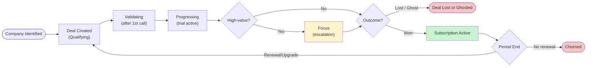
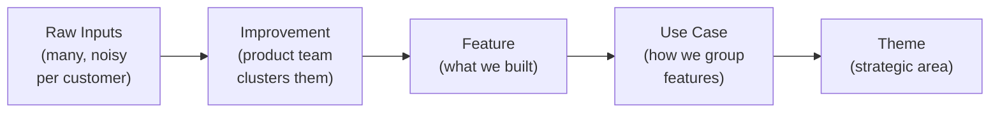

# Sales & Customer Lifecycle — Concept Doc

<!-- TOC -->

- [Overview](#overview)
  - [Where this dashboard sits in the Deal Intelligence System](#where-this-dashboard-sits-in-the-deal-intelligence-system)
- [Customer Lifecycle Flow](#customer-lifecycle-flow)
  - [Stage Definitions](#stage-definitions)
- [Use Case Narratives](#use-case-narratives)
  - [Sales Rep](#sales-rep-primary)
  - [Sales Manager](#sales-manager-primary)
  - [Product Team](#product-team-secondary--market-signals-tab)
  - [CS Rep](#cs-rep-secondary--relationship--customer-health-tabs)
- [Entity Overview](#entity-overview)
  - [Core — who does what, and what happens](#core--who-does-what-and-what-happens)
  - [Product Taxonomy — what the market is telling us](#product-taxonomy--what-the-market-is-telling-us)
- [How to Read This Dashboard](#how-to-read-this-dashboard)
  - [Role walkthroughs](#role-walkthroughs)
    - [Sales Rep — Monday morning (5 min)](#sales-rep--monday-morning-5-min)
    - [Sales Manager — Weekly review (15 min)](#sales-manager--weekly-review-15-min)
    - [Product Manager — Prioritization review (20 min)](#product-manager--prioritization-review-20-min)
    - [CS Rep — Account health check (10 min)](#cs-rep--account-health-check-10-min)
  - [The connected story — reading across tabs](#the-connected-story--reading-across-tabs)
- [Metrics — The Story](#metrics--the-story)
  - [Stage 1: FILL — Are we building a healthy pipeline?](#stage-1-fill--are-we-building-a-healthy-pipeline)
  - [Stage 2: CONVERT — Are we closing efficiently?](#stage-2-convert--are-we-closing-efficiently)
  - [Stage 3: UNDERSTAND — Why do we win or lose?](#stage-3-understand--why-do-we-win-or-lose)
  - [Stage 4: RETAIN — Are we keeping and growing customers?](#stage-4-retain--are-we-keeping-and-growing-customers)
- [Dashboard Tabs & Widgets](#dashboard-tabs--widgets)
  - [Tab 0: Overview](#tab-0-overview)
  - [Tab 1: Pipeline](#tab-1-pipeline)
  - [Tab 2: Performance](#tab-2-performance)
  - [Tab 3: Market Signals](#tab-3-market-signals)
  - [Tab 4: Relationship](#tab-4-relationship)
  - [Tab 5: Customer Health](#tab-5-customer-health)
- [Holistics Business Glossary](#holistics-business-glossary)
- [Notion References](#notion-references)

<!-- /TOC -->

---

## Overview

Every deal tells a story — and this dashboard reads them all.

A prospect becomes a customer through a series of calls, signals, and decisions. At each step, we're learning: what they need, what they're comparing us to, what's blocking the deal, and what makes us win. After they sign, the story continues — are they engaged, healthy, and growing with us, or quietly drifting toward churn?

This dashboard tracks that full arc. It starts with the pipeline: what deals are active, who owns them, and what needs attention today. It digs into performance: where are we winning, where are we leaking, and why. It surfaces market signals: what are customers asking for, which product gaps keep costing us deals, and what competitors keep showing up. And it closes the loop post-sale: are customers staying engaged, and are we catching the early signs before someone churns.

**Primary users:** Sales reps · Sales managers
**Secondary users:** Product team (Market Signals tab) · CS reps (Relationship & Health tabs) · BizOps / Revenue

**Dashboard:** 4 tabs — Overview · Pipeline · Win/Loss · Customers

### Where this dashboard sits in the Deal Intelligence System

This dashboard is the **viewing layer** of the Deal Intelligence System (v2). The system separates concerns across four layers:

```
HubSpot (action) → Automation (ingestion) → Git repo (understanding) → AI + Dashboard (reasoning & viewing)
```

| Layer | Role | What it holds |
|---|---|---|
| **HubSpot** | System of action — the only place reps interact | Deal stages, tasks (next steps), notes, emails, meetings |
| **Automation** | Ingestion pipeline — no human involvement | Normalizes HubSpot notes/tasks/emails, call transcripts (Read AI), Zendesk tickets into structured events linked to deal_id / company_id |
| **Git repo** | System of understanding — AI-readable deal memory | Per-deal markdown files (`deal.md`, `interaction-history.md`, transcripts, evidence) with YAML frontmatter for metadata filtering |
| **AI layer** | System of reasoning — on-demand, not always-on | Deal summaries, risk detection, objection extraction, coaching insights, CRM hygiene prompts, win/loss pattern analysis |
| **Dashboard** | Viewing layer — synthesized intelligence for stakeholders | This Holistics dashboard. Surfaces AI-enriched insights to users who don't want to query AI or read Git directly |

**Core principles from the Deal Intelligence System:**
1. Do not add friction to reps — reps stay in HubSpot, never touch Git
2. Separate input, storage, and viewing layers
3. Prefer automation over manual logging
4. Preserve raw evidence (transcripts, not just summaries) — AI needs nuance
5. Keep the repo scoped to active deals (inactive deals filtered by metadata, not moved)
6. Design for future AI workflows without requiring them on day one

**What this means for the dashboard:** The dashboard reads from the Git repo and AI layer, not directly from HubSpot. Deal context, interaction history, risk flags, and market signals are all pre-processed and enriched before they reach the dashboard. This makes the dashboard a consumer of intelligence, not a processor of raw CRM data.

---

## Customer Lifecycle Flow



### Stage Definitions

| Stage | When | Entry Criteria | Promotion Criteria |
|---|---|---|---|
| **Qualifying** | Before first call | Customer has SQL DB + knows SQL / dbt / LookML | Rep decides deal is worth pursuing after the call |
| **Validating** | After first call | First call completed, rep deems deal viable | Prospect signs up for trial AND connects data source |
| **Progressing** | Active evaluation | Trial signed up, data source connected | Deal closed won or lost (no required advancement gate) |
| **Focus** | Escalation overlay | BizOps / management identifies deal as high-priority (ICP fit or large MRR potential) | N/A — this overlays Progressing; deals close from here |
| **Lost** | Terminal | Explicit rejection or no response in reasonable time | — |
| **Won** | Terminal | Order form signed or subscription-bot notification | — |

**Focus deals** get a dedicated Slack channel, tracked blockers, management involvement, and rep acting as PM for blocker resolution. They are not a separate linear stage — a Progressing deal can be designated Focus at any time.

**Stage management process — what happens at each transition:**

| Stage | External activities | Internal activities (rep in HubSpot) | System automation (ingestion + AI) | CRM hygiene controls |
|---|---|---|---|---|
| **Qualifying** | Validate data source is supported; send relevant materials. Internalize discovery questions before each call | — | — | None |
| **→ Validating** | Check milestones: trial sign-up, sandbox test, partner intro | Fill Deal Profiling fields; update HubSpot Deal Notes; ensure deal has an open task with due date | Auto-create 3-day deadline task for market interaction notes; ingest call transcript → Git repo; AI extracts signals from discovery/demo calls | Mandatory fields on promotion; daily "Open Deals with No Open Tasks" report → #crm-hygiene; weekly Deal Notes staleness check → Slack |
| **→ Progressing** | Evaluate and suggest next milestones (see below); track milestone completion | Continue Deal Profiling; maintain open tasks; update notes | Ingest ongoing transcripts; AI tracks milestone progress; detect stalled deals (no milestone cleared in 14 days) | Same as Validating + milestone stall detection |
| **→ Focus** | Maintain prospect communication while blockers are resolved | Document blockers in deal channel | Auto-create dedicated Slack channel; seed with deal context from Git repo; AI monitors blocker resolution status | Management review via AI-generated pre-review summaries |
| **→ Lost** | Get explicit lost reason from prospect (email or recorded video) | Fill deal value; fill Deal Lost Details (compulsory); fill lost reason (how, why, details) | AI extracts structured lost reasons from transcripts and notes; auto-add company to revival nurturing list in HubSpot | Lost Deals Exception Report; Peer Market Learning sessions |
| **→ Won** | Ask for Win Interview to learn BI evaluation criteria | Update Company Profile; publish win notes | #subscription-bot notification triggers won workflow; AI generates deal summary for team learning | HubSpot task created for win notes publication; Company Profile Hygiene check |

**Evaluation milestones (Progressing stage):**
1. Repeat sharing session with colleagues
2. Completed Technical Onboarding
3. Completed Demos for Business Users
4. Supported Internal Business Case
5. Initiated Commercial Discussions

These milestones are tracked as checkpoints in HubSpot tasks. The AI layer monitors completion and flags stalled deals where no milestone has been cleared within 14 days.

---

## Use Case Narratives

This dashboard is built primarily for the **Sales team**. Product and CS are secondary consumers with dedicated tabs.

### Sales Rep *(primary)*

The sales rep needs to:

1. **Monitor their active pipeline** — what's new, what's ongoing, what's been ghosted (no activity in 45+ days), and what needs action today
2. **Understand capacity** — how many deals each rep owns, calls per week per rep, whether anyone is overloaded or underutilized
3. **Track their own deal responsibilities** — who the contacts are, what was discussed, what raw inputs were logged, what's the call schedule
4. **Know why deals are lost** — missing feature, pricing friction, competitor win, or ghosted — so they can adjust approach
5. **Manage prospect context** — reps maintain a company listing entry per prospect (set to "Prospect (Focus)") with Background, Key Contacts, and Interaction History — all cross-linked for easy context retrieval. The dashboard should surface this context in the deal detail panel without forcing reps to leave the screen
6. **Track key accounts** — reps flag accounts they actively manage with regular syncs or significant MRR impact as "Key Account." The dashboard should visually distinguish these and prioritize them in alert lists
7. **Get AI-assisted deal context** — instead of manually synthesizing call notes, the Deal Intelligence System auto-ingests transcripts and generates structured interaction histories. Reps update next steps in HubSpot; the system handles the rest. The dashboard surfaces this AI-enriched context (risk flags, objection history, coaching insights) without requiring reps to maintain a second system
8. **Receive CRM hygiene prompts** — the AI layer detects stale fields, missing deal notes, deals without open tasks, and overdue milestones. The dashboard flags these as actionable alerts, replacing the manual Weekly CRM Hygiene Sync scan

### Sales Manager *(primary)*

The sales manager needs to:

1. **See team pipeline and performance** — funnel conversion rates, avg time per stage, win rate vs. target, ghost rate
2. **Identify coaching opportunities** — which rep has low conversion at a specific stage, whose deals are stalling. The AI layer can generate coaching insights per rep based on transcript analysis (objection handling, discovery depth, follow-up patterns)
3. **Understand systematic blockers** — which lost reasons dominate, which competitors consistently hurt win rate
4. **Run deal reviews faster** — AI-generated pre-review summaries pull from the Git repo's deal memory, so managers can understand any deal in <2 minutes instead of reading through scattered HubSpot notes. The dashboard surfaces these summaries alongside the pipeline view
5. **Monitor CRM hygiene at scale** — instead of running weekly sync meetings to catch missing fields, the AI layer flags hygiene issues automatically. The dashboard shows a hygiene score per rep and surfaces the specific gaps

### Product Team *(secondary — Market Signals tab)*

The product team uses the Market Signals tab to:

1. **See aggregated market signals** — which improvements come up most, which are blocking deals vs. nice-to-haves. With the Deal Intelligence System, signals are auto-extracted from call transcripts — not just what reps remember to log, but every competitor mention, feature ask, and objection captured in the raw recording
2. **Understand competitor context** — which competitors are mentioned, in which deals, and whether their presence correlates with losses. AI extraction from transcripts catches competitor references that reps might not tag manually
3. **Track improvement status** — which customer problems are open, in progress, shipped, or have a workaround — and close the loop with reps when something ships
4. **Correlate signals with outcomes** — which unmet asks appear in lost deals vs. won deals. The Git repo preserves raw evidence for every closed deal, enabling AI-powered win/loss pattern analysis across the full deal history — not just the structured lost_reason dropdown

### CS Rep *(secondary — Relationship & Customer Health tabs)*

After a deal closes, the CS rep uses the Relationship tab to:

1. **See deal context inherited from sales** — what was promised, what the customer's concerns were, what competitors they evaluated. The Git repo's `deal.md` and `interaction-history.md` provide a complete, structured handoff — no more piecing together context from scattered HubSpot notes and Slack threads
2. **Monitor relationship health** — who hasn't been contacted recently, who's raising issues, who's going quiet
3. **Track renewal and churn signals** — plan changes, satisfaction indicators, whether customers are extending or at risk

---

## Entity Overview

10 conceptual entities across two groups. See [schema.md](schema.md) for full field definitions and enum values.

### Core — who does what, and what happens

| Entity | Purpose |
|---|---|
| `Company` | Any organization in the system — Holistics, prospects, customers, and competitors — in one table. For prospects, reps maintain a company listing entry with `Relationship with Holistics` set to "Prospect (Focus)" — including Background (company profile, ICP fit, tech stack), Key Contacts, and Interaction History with permalinks and cross-links. For active customers, reps flag key accounts (regular syncs or significant MRR) with a `Key Account` marker. |
| `Person` | Any individual — internal reps and external contacts — in one table. Reps identify key contacts and POCs across accounts — decision makers, champions, technical evaluators — and track next steps for building relationships with relevant users. |
| `Deal` | A commercial engagement from first contact to won, lost, or churned. Stage history is part of Deal, not a separate entity. In the Deal Intelligence System, each deal has a Git repo folder (`deals/<deal-slug>/`) containing `deal.md` (YAML frontmatter + summary), `interaction-history.md`, transcripts, and evidence files. Active vs. closed deals are filtered by metadata (`status: active / closed_won / closed_lost`), not by moving folders. |
| `Call` | Any touchpoint between Holistics and a company, pre- or post-sale. Who attended is a relationship of Call, not a separate entity. Five types in use (see below). |
| `Raw Input` | Any signal from a customer — auto-extracted from call transcripts, HubSpot notes, emails, and Zendesk tickets by the ingestion pipeline. Unified regardless of channel. In the Deal Intelligence System, raw inputs are primarily machine-generated from transcripts (competitor mentions, feature asks, objections, blockers) rather than manually logged by reps. Rep-authored HubSpot notes supplement the auto-extracted signals with human context and corrections. |

**Call types and where they sit in the lifecycle:**

| Call Type | Phase | Purpose | Typical raw inputs generated |
|---|---|---|---|
| **Discovery** | Pre-sale (Qualifying) | First call — understand the prospect's tech stack, pain points, use case, and whether they have SQL/dbt/LookML skills. Rep decides if the deal is worth pursuing | ICP fit signals, competitor mentions, initial feature asks, tech stack details |
| **Demo** | Pre-sale (Qualifying → Validating) | Show Holistics capabilities against the prospect's use case. Often the make-or-break call for moving to trial | Feature gaps surfaced, comparison to competitor capabilities, pricing concerns, stakeholder reactions |
| **Technical Onboarding** | Pre-sale (Validating → Progressing) | Help the prospect connect their data source, build their first models, and evaluate Holistics on real data during the trial period | Technical blockers, integration issues, data modeling questions, "works / doesn't work" signals |
| **Business User Onboarding** | Pre-sale (Progressing) | Train non-technical users (viewers, analysts) on consuming dashboards and reports — tests whether Holistics works for their full team, not just the data team | Usability feedback, permission/sharing asks, embedding requirements, adoption friction |
| **Customer Success Review** | Post-sale (Active) | Regular sync with active customers — check satisfaction, gather feedback, identify expansion or churn signals. Cadence varies by account importance | Renewal signals, upsell opportunities, open issues, feature requests, satisfaction indicators |
| `Subscription` | The active billing state that results from a won deal. Runs until the customer churns or a new deal replaces it. |

### Product Taxonomy — what the market is telling us

| Entity | Purpose |
|---|---|
| `Theme` | Top-level strategic area (e.g. Collaboration, Data Governance, Reporting Speed) |
| `Use Case` | How the product team groups customer needs within a theme (e.g. External sharing, Column-level access) |
| `Feature` | What's actually built in the app. Has its own lifecycle status. Belongs to a use case. |
| `Improvement` | The product team's synthesis of multiple raw inputs into one coherent customer problem, with specific requirements documented. Bridges raw inputs to features. |

**How the product taxonomy connects:**



An Improvement can link to an existing Feature (as a sub-need or enhancement) or be unlinked (new territory, no feature yet). Many raw inputs cluster into one Improvement. When a Feature ships, all linked Improvements with open status can be flagged for rep follow-up.

---

## Metrics — The Story

Metrics form a causal chain. When something goes wrong, follow the chain to diagnose why.

```
FILL → CONVERT → UNDERSTAND → PERFORM → RETAIN
```

**Example:** Win rate drops → Stage conversion shows drop at Validating → Lost reason analysis reveals "Missing Feature" at 38% → Call insights confirm SSO is the top blocker → Product ships SSO → Promise tracker notifies rep → Rep follows up with lost prospects. Meanwhile: rep scorecard shows Jordan's ghost rate at 21% — that's a coaching conversation, not a product fix.

---

### Stage 1: FILL — Are we building a healthy pipeline?

| Metric | What it tells you | How to calculate |
|---|---|---|
| Active pipeline value | Total deal value in progress — is there enough? | `SUM(deal_value_usd) WHERE status = 'in_progress'` |
| Pipeline coverage | Active pipeline $ / quarterly quota — below 2.5× is a fill problem, not a conversion problem | `SUM(active_pipeline_value) / quarterly_quota` |
| New deals this period | Are we adding enough top-of-funnel? | `COUNT(deals WHERE created_at >= period_start)` |
| Deal value growth over time | How is each month/quarter performing independently? Spot momentum shifts before they compound | `SUM(deal_value_usd) GROUP BY period` — trend, not running total |
| Deal value vs target | When aggregated, is the team on pace? | `SUM(deal_value_usd) vs quota_target` per period — show the gap |
| Ghost rate | % of open deals with no activity in 45+ days — pipeline hygiene signal | `COUNT(deals WHERE last_activity < today - 45) / COUNT(open deals)` |
| Open deals per rep | Load vs. capacity target — overloaded reps let deals stall | `COUNT(deals WHERE status = 'in_progress') GROUP BY owner_id` |

---

### Stage 2: CONVERT — Are we closing efficiently?

| Metric | What it tells you | How to calculate |
|---|---|---|
| Conversion funnel by stage | Where deals drop off — the exact leaking stage. Break down by country to spot regional underperformance | Holistics Conversion Funnel chart: deal count per stage, with country as breakdown dimension |
| Funnel deal value indicator | Some deals exit before pricing discussion — count alone misses this. Show total deal value at stages where value exists | `SUM(deal_value_usd) WHERE deal_value_usd IS NOT NULL GROUP BY stage` — annotate early stages where many deals lack a value |
| Win rate | The headline outcome metric | `COUNT(status='won') / COUNT(status IN ('won','lost'))` |
| Avg sales cycle (won) | How long winning deals take — are we speeding up or slowing down? | `AVG(closed_at - created_at) WHERE status = 'won'` |
| Avg sales cycle (lost) | How long we spend on deals we lose — wasted rep capacity | `AVG(closed_at - created_at) WHERE status = 'lost'` |
| Deal cycle nuance | Ghost deals and deals that return 1–2 years later distort the average. Separate "clean" cycles from interrupted ones to get honest velocity | Exclude deals with >90-day inactivity gaps from primary cycle metric; track "re-engaged" deals separately |
| Stage conversion rate | % advancing per stage pair — find the specific leak | `COUNT(deals reaching stage N+1) / COUNT(deals entering stage N)` per pair |
| Avg time per stage | Where deals slow down even if they don't drop | `AVG(COALESCE(exited_at, today()) - entered_at) GROUP BY stage` via `deal_stage_history` |
| Lost reason breakdown | Why we lose — flag if any one reason > 40% | `COUNT(*) / SUM(COUNT(*)) OVER () FROM deals WHERE status='lost' GROUP BY lost_reason` |

---

### Stage 3: UNDERSTAND — Why do we win or lose?

| Metric | What it tells you | How to calculate |
|---|---|---|
| Win reason analysis | What patterns appear in won deals — product fit, rep skill, competitive gap, pricing advantage? | Categorize won deals by primary win factor; track distribution over time |
| Lost reason breakdown | Why we lose — flag if any single reason exceeds 40% | `COUNT(*) GROUP BY lost_reason WHERE status='lost'` — annotated with escalation thresholds |
| Competitor displacement rate | Which competitors hurt our win rate most | `WIN_RATE(deals with competitor X) - WIN_RATE(deals without)` per competitor |
| Competitor deep analysis | What prospects say about competitors in calls — praise (what they do well), complaints (weaknesses), things we can learn, failures we can avoid | AI-extracted from call transcripts; categorize as praise / complaint / learning / failure per competitor |
| Feature request tracking | Single source of truth: what prospects/customers ask for, linked to deals. Visible to sales (for introducing solutions), product (for building), CS (for following up) | `improvements` table linked to `raw_inputs` and `deals` — status tracked: backlog → in-flight → shipped |
| Top improvements by deal count | Which customer problems come up most — roadmap priority signal | `COUNT(DISTINCT deal_id) FROM raw_inputs GROUP BY improvement_id ORDER BY count DESC` |
| Blocking improvements in lost deals | Which unmet needs appear most in losses | `COUNT(deals WHERE status='lost') per improvement WHERE is_blocking = true` |
| Customer/prospect feedback | Raw input from calls: reply to specific requests, gather feature requirements, understand market expectations | `raw_inputs` categorized by type (feature_ask, bug, concern, praise) linked to company + deal |
| Trial feedback vs. outcome | Does evaluation help or hurt? What friction do prospects encounter? | `raw_inputs WHERE call_type IN ('technical_onboarding', 'business_user_onboarding')` grouped by deal outcome — enriched by AI-extracted signals from onboarding call transcripts |

---

### Stage 4: PERFORM — Are reps effective and at capacity?

| Metric | What it tells you | How to calculate |
|---|---|---|
| Rep win rate | Is the rep converting at or above target? | `COUNT(won) / COUNT(won + lost) GROUP BY owner_id` |
| Rep deal count (total) | Total deals touched — lifetime performance signal | `COUNT(deals) GROUP BY owner_id` |
| Rep current deal load | Number + value of deals currently in progress — capacity indicator | `COUNT(deals WHERE status='in_progress')` + `SUM(deal_value_usd)` per rep |
| Rep-specific deal list | Which specific deals each rep owns — name, value, stage, days in stage | Drill-through table filtered by `owner_id` |
| Rep calls per week | Is the rep putting in enough outbound activity? | `COUNT(calls WHERE call_date >= week_start) GROUP BY owner_id` |
| Rep ghost rate | Are deals going dark under this specific rep? | `COUNT(ghost_deals) / COUNT(open_deals) GROUP BY owner_id` |
| Rep capacity assessment | Overloaded (too many deals, too few calls) or underutilized? | Composite: open deals vs. team avg + calls/week vs. target + ghost rate |

---

### Stage 5: RETAIN — Are we keeping and growing customers?

| Metric | What it tells you | How to calculate |
|---|---|---|
| Customer count | Total active customers — is the base growing? | `COUNT(DISTINCT company_id) WHERE customer_status = 'active'` |
| Customer value (MRR) | Monthly recurring revenue — the financial health signal | `SUM(mrr_usd) WHERE subscription_status = 'active'` |
| MRR by period | Monthly/quarterly performance — spot trends before they compound | `SUM(mrr_usd) GROUP BY month` — show expansion, contraction, churn components separately |
| Plan change tracking | Upgrades, downgrades, plan switches — are customers growing with us? | `COUNT(*) GROUP BY change_type` per period |
| Customer geography | Where customers concentrate — market fit signals by country | `COUNT(customers) GROUP BY country` — choropleth map visualization |
| Net Revenue Retention (NRR) | Revenue retained + expanded — >100% = growing from existing base | `(starting_mrr + expansion - contraction - churn) / starting_mrr × 100` per month |
| MRR churn rate | % of revenue lost to churn each month | `SUM(mrr_usd of churned subscriptions in month M) / starting_mrr_M` |
| Engagement by channel | Which channels customers use most: community, Slack, support tickets, calls | `COUNT(interactions) GROUP BY channel` per company — shows where to invest support effort |
| Ticket metrics | Tickets sent, resolved, satisfaction — are we resolving or accumulating? | `COUNT(tickets)`, `COUNT(resolved)`, `AVG(csat_score)` per period |
| Contact recency | Days since last catch-up call — identifies accounts going dark before they churn | `DATEDIFF(today(), MAX(call_date)) GROUP BY company_id` |
| Satisfaction score | Are customers happy? Track over time for drift | `AVG(satisfaction_score)` per company or aggregated per period |
| Version adoption | Are customers on the latest version? Proactively suggest upgrades | `COUNT(customers) GROUP BY product_version` — flag outdated |
| At-risk composite flag | Early warning before churn | Weighted: days-dark (40%) + no-upgrade (30%) + open-issues (30%) — surface above threshold |
| Time to first CS touch | Days from subscription start to first post-sale call — long lag = delayed value | `MIN(call_date WHERE phase='post_sale') - subscriptions.started_at` per company |


---

## Dashboard Design Framework

This section codifies the design principles that govern every tab, widget, and annotation. Use it when evaluating whether a new element belongs in the dashboard and how it should be presented.

---

### The core problem dashboards fail to solve

Most dashboards are designed from the **data outward** — "we have these metrics, so let's put them on a screen." The result is a screen full of correct numbers that nobody acts on.

The problem isn't the data. It's that the dashboard leaves the interpretive work to the user. A sales rep opens a screen with a 34% win rate, a stage conversion funnel, a ghost rate trend, and six more charts — and has to synthesize all of it into a single question: *what do I do right now?*

The design principle for this dashboard: **the screen does the synthesis, not the user.** The user's job is to act, not to analyze.

This is the argument in Cole Nussbaumer Knaflic's *Storytelling with Data* applied to operational dashboards: every chart should have a title that states the finding, not just the measure. "Stage Conversion Funnel" is a label. "Qualifying → Validating is where we lose most deals (−21pp)" is an insight. The first makes the user work; the second makes the user act.

---

### The four-layer model: Question → Insight → Evidence → Act

Every widget in the dashboard follows this chain:

| Layer | What it is | How it appears |
|---|---|---|
| **Question** | What the user is trying to figure out | Tab name, section header |
| **Insight** | The answer, stated plainly in the title or brief | Card title, Morning Brief item, narrative summary |
| **Evidence** | The data that supports the insight | Chart, table, list |
| **Act** | What the user should do | "Next step" text, action card, cross-reference link |

A widget that shows only Evidence without the Insight forces the user to do the analytical step the dashboard should have already done. A widget that shows only Insight without Evidence is an assertion the user can't verify. Both layers must be present.

---

### Four design principles

**1. Insight-first titles**

Card titles state the finding, not the measure.

| Instead of | Use |
|---|---|
| "Stage Conversion Funnel" | "Qualifying → Validating is the biggest leak (−21pp)" |
| "Win Rate KPI" | "Win rate 6pp below target — driven by product gaps, not rep performance" |
| "Ghost Rate Trend" | "Ghost rate climbing: more deals are being created than actively worked" |
| "Lost Reason Breakdown" | "Missing Feature at 38% — near the 40% escalation threshold" |

The title change is not cosmetic. It changes what the user does after reading. A descriptive title produces a nod. An insight title produces a decision.

**2. Situational awareness first — the status strip and the Morning Brief**

A user opening a dashboard has one real question before they look at any chart: *what is the current situation?* Two patterns address this at different levels of implementation complexity.

**The status strip** (current implementation) appears at the top of every tab as a 1–2 sentence summary with color coding — green for on track, amber for watch, red for action needed. It states the situation plainly:

> *"Win rate 34% — 6pp below the 40% target, improving +3pp vs Q4. The main risk: 'Missing Feature' in 38% of losses and ghost rate climbing to 14%."*

This is lightweight enough to build and maintain. It gives every user — exec, rep, manager — the context they need before reading any chart. In Holistics, this is implemented as a text/annotation widget pinned to the top of each tab.

**The Morning Brief** goes further: an AI-generated card that synthesizes the 2–3 most urgent items across all tabs into numbered, named, action-oriented lines — personalized by role:

> *"3 things need your attention today: TrustLayer is 94 days dark with a critical bug open — book a call. HealthTrack evaluation is at 10 am — push for signature. James Wilson is under-pacing on calls — check in before standup."*

The Morning Brief is powered by the Deal Intelligence System's AI layer reading the Git repo on demand. It combines ghost threshold, days-since-contact, days-to-renewal, below-target calls/week, CRM hygiene gaps, and milestone stall signals — all already computed by the ingestion and AI layers. It also surfaces AI coaching insights for managers (e.g., a rep's recent transcript analysis shows weak objection handling on a specific deal).

**Implementation guidance:** Build the status strip first. It solves 80% of the orientation problem with 10% of the complexity. The Morning Brief becomes feasible once the Deal Intelligence System's Git repo and AI layer are operational — at that point, the data and reasoning needed to generate it already exist.

**3. Role-aware views — the same data, different questions**

A sales rep and a sales manager look at the same pipeline and ask fundamentally different questions. The rep asks: *what do I do with my 12 deals today?* The manager asks: *which of my 4 reps needs coaching this week?* Showing both audiences the same screen makes neither useful.

The **My / Team toggle** in the filter bar routes users to the right view:

| Role | Default view | First question answered |
|---|---|---|
| Sales rep | My View | "What do I do today?" — personal call schedule + action list |
| Sales manager | Team View | "How is the team tracking?" — rep capacity cards + pipeline snapshot |
| C-level / exec | Performance tab | "Are we on target?" — narrative summary first, then charts |
| Product team | Win Deals → Product Blockers | "What's costing us deals?" — blockers sorted by $ at risk |
| CS rep | Keep Customers | "Which accounts need me?" — re-engage and open issues |

**4. Evidence chains — connect the dots across tabs**

When an insight in one tab is caused by something in another tab, that connection is explicit. Users do not navigate blindly.

```
Performance: "Missing Feature at 38% of losses"
  → cross-reference chip: "See Product Blockers in Win Deals"

Win Deals: "SSO/SAML blocking 4 deals · $71K at risk"
  → cross-reference chip: "9 past losses cited this · see Performance"

Keep Customers: "Column Masking shipped 36 days ago"
  → cross-reference chip: "9 customers haven't been notified · see Promise Tracker"
```

Without these links, the dashboard is a collection of siloed views. With them, it is a diagnostic chain.

---

### What does NOT belong on a dashboard

**Metrics without targets.** A number without a benchmark is noise. 34% win rate means nothing without knowing the target is 40%. Every KPI needs either a target or a prior-period comparison.

**Charts without insight titles.** If the card title only describes the measure ("Stage Conversion Funnel"), the user must do the interpretation. They will sometimes interpret it wrong, or skip it entirely when short on time.

**Data without a downstream action.** If a user can see a problem but cannot act on it from the same screen, the widget creates anxiety without providing value. Every problem surfaced should link to either an action (a next step) or an escalation path (a cross-reference).

**Everything for everyone.** A dashboard that tries to serve all audiences equally serves none well. The filter bar, role-based views, and tab structure are all designed to route users to what is relevant to them, while keeping the full picture accessible for those who need it.

**Metrics without timestamps.** For operational dashboards — ghost deal alerts, at-risk flags, accounts going dark — data freshness is critical. An alert built on yesterday's data can already be wrong by the time a rep reads it. Every tab with time-sensitive signals should include a "Last refreshed: X hours ago" indicator. A number without a freshness timestamp is a number the user cannot fully trust.

---

### Reading model by role

#### Sales rep — Monday morning (5 min)
1. **Overview → status strip** → Read the situation in one sentence. Is this a product problem, a pipeline problem, or a rep problem?
2. **Pipeline → My View** → Check your call schedule for today and this week. What do you need to prepare?
3. **Pipeline → signal bar** → Ghost count, stuck count, closeable count. Your priorities for the day.
4. **Pipeline → deals table** → Sorted by urgency — closeable deals at the top, ghosts below. Act on them in that order.

#### Sales manager — Weekly review (15 min)
1. **Overview → status strip + KPIs** → Win rate vs. target, ghost rate, NRR. Is anything in red?
2. **Overview → rep performance table** → Who is outlying in win rate or calls/week? That's your coaching conversation this week.
3. **Pipeline → Team View → rep capacity cards** → Who is overloaded? Who has bandwidth? Ghost rate and rep workload move together.
4. **Win/Loss → stage conversion funnel** → Where are deals dropping? If a stage drops >20pp, that's your team's coaching focus.
5. **Win/Loss → lost reason breakdown** → If "Missing Feature" is above 40%, that's a product escalation, not a sales coaching conversation. Take the blocker cards to PM with the $ at risk.

#### C-level — Quick pulse (3 min)
1. **Overview → status strip** → Win rate, trend, top risk. Are the problems operational or structural?
2. **Overview → 4 KPI cards** → Pipeline, ghost rate, NRR. Any red numbers?
3. **Customers → status strip** → NRR, at-risk accounts, renewal exposure. The retention picture in one sentence.

#### Product team — Signal review (20 min)
1. **Pipeline → blocker cards** → Sorted by company count. Each card shows which active deals are blocked and the $ at risk. Sort by company count, not raw input count — 8 companies mentioning an issue once each outranks 1 company mentioning it 12 times.
2. After shipping: **Customers → Promise Tracker** → The list of customers who raised the now-shipped improvement. Close the loop with the rep who owns each account.

---

## Dashboard Tabs & Widgets

Each tab answers a specific business question at a specific level of abstraction. Tabs form a connected story — start at **Overview** for the big picture, then drill into specialist tabs for increasing detail. The rule: **never mix abstraction levels within a tab.** Overview is for executives scanning the whole process; Pipeline is for sales teams tracking specific deals; deeper tabs are for analysis and action.

The tab structure evolved across eleven prototypes. The current structure (v12) uses 5 tabs that map to the metric story chain (FILL → CONVERT → UNDERSTAND → PERFORM → RETAIN), with a new Calls & Market Intel tab serving the dual-purpose need for sales call management and product market intelligence.

**Dashboard:** 5 tabs — Overview · Pipeline · Performance · Calls & Market Intel · Customers

---

### Tab 0: Overview
**Primary user:** Executive · VP · Sales manager (30-second pulse)
**Key question:** How is the company's sales engine performing overall?
**Filters:** Period selector · Deal type (new business / renewal / expansion) · Country
**Abstraction level:** Highest — big picture only, no individual deals or reps

The executive tab. KPIs are organized as a story flow (Pipeline In → Conversion → Revenue Out → Speed), followed by the funnel, geography, and an actionable lost-reason table. No status strips — the KPI story IS the status. Everything is aggregate — drill into Pipeline or Performance for specifics.

| Widget | Type (Holistics chart) | Description |
|---|---|---|
| **4 KPIs (story flow)** | | |
| Active pipeline | KPI Metric | Total open deal value + count + coverage ratio. **Story: what's coming in** |
| Win rate | KPI Metric | Won / (won + lost) vs. target + delta. **Story: how well we convert** |
| Closed revenue vs quota | KPI Metric | This period revenue vs. quota + attainment %. **Story: what came out** |
| Avg sales cycle | KPI Metric | Average days to close won deals + delta. **Story: how fast** |
| **Row 1** | | |
| Sales stages funnel | Conversion Funnel | Qualifying → Validating → Progressing → Focus → Won with conversion % and deal value annotation at stages where pricing has been discussed. **Breakdown by country** available |
| Won vs Lost monthly trend | Bar Chart (grouped) | 6-month view of won vs. lost count — simple, immediately understandable |
| **Row 2** | | |
| Revenue geography | Geo Map (pin markers) | World map with country pin markers showing flag + country name + total revenue value. Left sidebar shows: top performing country, revenue growth %, period. Styled like a real map dashboard — no inline filters needed |
| Lost reason actionable table | Data Table | Reason · % of Losses · # Deals · $ Lost · Top Blocker Detail · Action. Each row tells you what's failing AND what to do about it. E.g., "Missing Feature | 38% | 30 | $292K | SSO/SAML (9 deals) | Escalate to Product if hits 40%" |
| **Bottom** | | |
| Cross-tab nav bar | Dynamic Content Block | "Drill into →" links to Pipeline, Performance, Calls & Market Intel, Customers — each with a count of items needing attention |

---

### Tab 1: Pipeline
**Primary user:** Sales rep · Sales manager
**Key question:** What deals need attention right now, and what's their current status?
**Filters:** Sales rep · Stage · Deal type · Country
**Abstraction level:** Operational — individual deals visible, grouped by status

The deal-level operational view. Organized into three deal status groups that map to the Go-to-Market sync workflow: **New deals** (just entered pipeline), **Progressing deals** (actively being worked), and **Results** (recently won or lost). After a deal changes status (e.g., won → customer active, or lost → prospect inactive), it leaves this view — only deals requiring active sales attention appear here.

**Scope rule:** Only show deals where the company is: customer (upsell/downgrade in discussion), prospect (active), or prospect (focus). Won deals that have transitioned to active customer status and lost deals marked prospect (inactive) are excluded.

| Widget | Type (Holistics chart) | Description |
|---|---|---|
| **Section: New Deals** | | |
| New deals summary | KPI Metric (×2) | Count of deals created this period + total new deal value. Both count and value shown for consistency |
| New deals table | Data Table | Company · Value · Country · Source · Sales rep · Created · Stage · **Last Interaction** · **Next Call**. Actionable: reps can see what to do next |
| **Section: Progressing Deals** | | |
| Progressing summary | KPI Metric (×4) | Focus (count + value) · At Risk (count + value) · Highlight (count + value) · Promising (count + value). All KPIs show both count AND value for consistency |
| Progressing deals table | Data Table | Signal · Company · Stage · Sub-status (Focus / At Risk / Highlight / Promising) · Value · Days in stage · Last activity · Blockers · Next step · Sales rep. Sorted: Focus → At Risk → Highlight → Promising |
| **Section: Results** | | |
| Results summary | KPI Metric (×2) | Won (count + value) · Lost (count + value). Consistent format with other sections |
| Recent results table | Data Table | Outcome · Company · Value · Sales rep · Days to close · Lost reason · Closed date · **Key Learning** · **Follow-up**. Actionable: what we learned and what happens next |
| Deal detail drill-through | Expandable panel | Click any deal row → full detail: company background, key contacts, call history, raw inputs, AI-generated summary, blocker status, next step |

**Focus deals note:** Focus deals get a visual badge (⚡) and always surface at the top of the Progressing table regardless of other signals. Each Focus deal has a dedicated Slack channel, tracked blockers, and management involvement — that context is visible in the drill-through panel.

**Ghost threshold note:** 45-day ghost threshold is calibrated for the default sales cycle. Enterprise deals (>6 months expected) should use a configurable threshold per deal type.

---

### Tab 2: Performance
**Primary user:** Sales manager · BizOps · Executive
**Key question:** Why are we winning and losing, how are reps performing, and are we on pace?
**Filters:** Period · Sales rep · Deal type · Company size tier (SMB / Mid-Market / Enterprise) · Country
**Abstraction level:** Analytical — aggregated metrics, trends, and comparisons. No individual deals (those are in Pipeline)

The analysis tab. Combines win/loss analysis, deal velocity metrics, and rep performance into one view. Organized top-to-bottom: **headline metrics** → **why we win/lose** → **deal velocity** → **rep performance** → **competitive landscape**. Each section answers the natural "and then what?" from the previous one.

| Widget | Type (Holistics chart) | Description |
|---|---|---|
| **Section: Headline Metrics** | | |
| Win rate % | KPI Metric | Current period win rate vs. 40% target + delta vs prior period |
| Avg cycle (won) | KPI Metric | Average days to close won deals + stage breakdown |
| Avg cycle (lost) | KPI Metric | Average days for lost deals — wasted capacity indicator |
| Deal value growth | KPI Metric | This period's deal value vs. same period last year — momentum signal |
| **Section: Win / Loss Analysis** | | |
| Win vs Loss by reason | Data Table (actionable) | **ONE combined table replacing 3 separate charts.** Columns: Reason · Won Deals · Won $ · Lost Deals · Lost $ · Key Insight · Action. Shows both sides of each factor in one view with actual insights and next steps. E.g., "Missing Feature | 2 won | $18K | 30 lost | $292K | SSO/SAML is 60% of feature losses | Escalate to Product at 40% threshold" |
| Competitive landscape | Data Table | Moved here from standalone section — belongs with why we lose. Columns: Competitor · Deals Mentioned · What Prospects Say About Them · What Prospects Say About Us · Win Rate Impact. Shows verbatim positioning from call transcripts |
| **Section: Deal Velocity** | | |
| Stage conversion funnel | Conversion Funnel | Qualifying → Validating → Progressing → Won with conversion % — the ONE velocity chart. Identifies the primary drop-off point |
| Deal value per period by segment | Combination Chart (column + line) | Quarterly deal value by segment (SMB/Mid-Market/Enterprise stacked columns) with target line overlay |
| **Section: Rep Performance** | | |
| Rep scorecard table | Data Table | Per rep: total deals · open deals · pipeline $ · win rate % · win rate $ · calls/week · ghost rate · trend · top loss reason. Conditional formatting: green if above target, red if below. Click row to filter Pipeline tab to that rep's deals |

**Evidence-grounded analysis note:** The Git repo preserves raw transcripts alongside summaries. When a manager clicks into a lost reason pattern, they can trace it to specific transcript moments.

---

### Tab 3: Calls & Market Intel
**Primary user:** Sales rep (call management) · Product team (market intelligence)
**Key question:** What calls are coming up, what are customers/prospects telling us, and what is the market saying?
**Filters:** Period · Sales rep · Call type · Company · Competitor
**Abstraction level:** Operational + strategic — individual calls and signals, aggregated into market patterns

This tab serves two audiences with one data source. **Sales reps** use the top half to manage their call schedule, track upcoming calls, and access AI-summarized call insights. **Product teams** use the bottom half to understand competitor positioning, gather requirements from customer feedback, and track feature requests as a single source of truth.

| Widget | Type (Holistics chart) | Description |
|---|---|---|
| **Section: Call Management (Sales)** | | |
| Calls this week | KPI Metric (single) | Completed / scheduled with progress bar. One KPI, not two — the progress bar shows the remaining at a glance |
| Call calendar | Dynamic Content Block (calendar heatmap) | Monthly calendar showing call density by day. Color intensity = number of calls. Reps use this to spot gaps in their schedule |
| Upcoming calls checklist | Data Table | Next 14 days: Date · Company (linked to Pipeline deal) · Type · Sales rep · Prep notes. Companies link conceptually to Pipeline deals for context |
| Recent call insights | Expandable cards | Completed calls as expandable cards (not flat table rows — content can be long). Each card shows: company, call type, date, rep. Expand for: full AI summary, action items, feature requests raised. Scales better than table rows for lengthy summaries |
| **Section: Feature Request Tracker (Single Source of Truth)** | | |
| Feature request table | Data Table | Scalable table (not kanban — kanban breaks at 1000+ requests). Columns: Feature · Status (pill: Backlog / In Review / In Flight / Shipped) · Companies · Raw Inputs · $ at Risk · Priority. Sortable, filterable. **This is the single source of truth** — sales uses it to introduce features, product to prioritize, CS to follow up |
| Feature requests by impact | Bubble Chart | X-axis: requesting companies, Y-axis: deal value at risk, Bubble size: raw input count |
| **Section: Market Intelligence (Product)** | | |
| Competitor mention frequency | Column Chart (stacked) | Monthly competitor mentions — who is appearing more or less over time |
| Competitor deep analysis | Pivot Table | Competitors × praise/complaints/learnings/failures. Count of mentions per cell. Click cell to see raw quotes |
| Verbatim quotes | Data Table | What prospects actually said — about competitors AND about us. Columns: Company · About · Quote · Context (call type, date). Gives product team exact language for positioning and roadmap decisions |
| Customer/prospect feedback | Data Table | Raw inputs categorized: feature_ask · bug · concern · praise. Date · Company · Type · Verbatim · Deal status · Linked improvement |

**Dual-purpose design note:** Sales reps use the top half (call management). Product teams use the bottom half (market intelligence). The lost-to-competitor analysis was moved to the Performance tab's Win/Loss section where it belongs contextually.

---

### Tab 4: Customers
**Primary user:** CS rep (daily triage) · CS manager (health and retention) · Executive (customer base overview)
**Key question:** Are customers happy, engaged, and growing — and which ones need attention?
**Filters:** CS rep (account owner) · Company · Plan tier · Country · Health status (healthy / watch / critical)
**Abstraction level:** Mixed — starts with aggregate customer base metrics (exec-friendly), then drills into individual account triage (CS-focused)

The post-sale tab. Organized top-to-bottom: **customer base overview** (count, value, version distribution) → **engagement & satisfaction** → **account triage** → **customer geography**. Revenue health (MRR/NRR trends) was removed — this dashboard focuses on sales, not finance.

| Widget | Type (Holistics chart) | Description |
|---|---|---|
| **Section: Customer Base Overview** | | |
| Active customers | KPI Metric | Total active customer count + net change this period |
| Total MRR | KPI Metric | Current monthly recurring revenue + delta vs. prior period |
| Avg MRR per customer | KPI Metric | Revenue concentration indicator — rising = healthy upsell, dropping = plan downgrades |
| NRR (trailing 90d) | KPI Metric | Net Revenue Retention vs. 100% target |
| Tenant version distribution | Bar Chart (horizontal) | Customer count by product version (v4.0, v3.0, v2.7, v2.5, v2.0) with MRR annotation. Identifies who to proactively suggest upgrades to. **Replaces the geo map slot** — more actionable for sales |
| Plan distribution | Donut Chart | Customer count by plan tier — free, starter, professional, enterprise |
| Plan change tracking | Column Chart (stacked) | Monthly upgrades vs. downgrades — are customers growing with us? |
| **Section: Engagement & Satisfaction** | | |
| Satisfaction score trend | Line Chart | Average CSAT over time with target reference line |
| Ticket metrics | Metric Sheets | Tickets opened · resolved · avg resolution time · CSAT — by month with sparklines |
| Engagement by channel | Donut Chart | Interactions by channel: community · Slack · tickets · calls. Investment signal for support |
| **Section: Account Triage** | | |
| Customer triage table | Data Table (conditional formatting) | The primary working list. Account · MRR · Plan · Days dark (red >60, amber 31–60) · Renewal in (red ≤30d) · Open tickets (red ≥3) · Health (Critical / Watch / Healthy) · Channel · Action. Sorted: Critical → Watch → Healthy, then by MRR |
| **Section: Customer Geography (below triage)** | | |
| Customer geography | Geo Map (pin markers) | Moved below triage — not the primary view. World map with pins showing customer count + MRR per country |

**Health score logic** (visible in triage table, not hidden):
- **Critical:** renewal ≤30d AND (dark >60d OR ≥3 open issues)
- **Watch:** dark 31–60d OR renewal 31–60d OR 1–2 open issues
- **Healthy:** contact <30d AND no imminent renewal AND ≤0 open issues

Future improvement: weighted score (days-dark 40% + no-upgrade 30% + open-issues 30%) with configurable threshold.

**Known data gap:** The health model relies on relationship activity (calls, raw inputs) and billing signals only — no product usage data. A customer who stopped using the product won't appear at-risk until they miss a check-in. If usage event data becomes available, add it as a fourth signal.

**Deal Intelligence System scope note:** The current system is scoped to **Deal Intelligence** (active deals, current context). **Customer Intelligence** — long-term account history, support + usage signals, expansion insights — is a future extension. When built, this tab gains significantly richer health signals.

---

## How to Read This Dashboard

The dashboard is organized as a **drill-down story**, not a collection of independent reports. Each tab answers one question and hands off to the next when you need to go deeper.

```
Overview → "Something's off — which area needs attention?"
  ↓
Pipeline → "Where exactly is the deal-level problem?"
  ↓
Win/Loss → "How bad is it, and what's the pattern?"
  ↓
Customers → "Who's at risk post-sale right now?"
```

---

### Role walkthroughs

#### Sales Rep — Monday morning (5 min)

> *"Where do I spend my time this week?"*

1. **Overview → status strip** → Read the situation in one sentence. Is the team's main problem product gaps, pipeline volume, or rep execution?
2. **Pipeline → My View → signal bar** → Ghost count, stuck count, closeable count. These are your priorities.
3. **Pipeline → deals table** → Sorted by urgency — closeable deals at the top, ghosts below. Deals in green are closeable this week; don't let them slip while chasing amber.
4. **Pipeline → call schedule** → Confirm your calls for today and this week. A discovery call means 20–40 raw inputs to log afterward — product signals, competitor mentions, concerns.

**Key number to watch:** *Days in current stage* in the deals table. A deal stuck in Validating for 3+ weeks almost always has an unresolved blocker — check its raw inputs for `deal_breaker` flags.

---

#### Sales Manager — Weekly review (15 min)

> *"Is the team on track, and where do I need to intervene?"*

1. **Overview → status strip + KPIs** → Win rate, pipeline value, ghost rate. If win rate is down and pipeline is flat, you have a systemic conversion problem — not just a slow week.
2. **Overview → rep performance table** → Win rate and calls/week per rep. A 30pp spread between top and bottom rep is a coaching signal, not a sampling artifact.
3. **Pipeline → Team View → rep capacity cards** → Who is overloaded? Who has bandwidth? A rep with 15+ open deals is likely letting deals go dark — ghost rate and rep workload move together.
4. **Win/Loss → stage conversion funnel** → Find the stage where deals are dropping. If 60 deals entered Validating but only 30 moved to Progressing, that's a 50% drop — your coaching focus for the week.
5. **Win/Loss → lost reason breakdown** → If `missing_feature` is above 40%, that's a product escalation, not a sales problem. Take the Pipeline blocker cards to PM with the $ at risk per improvement.

**Key number to watch:** *Stage conversion funnel* — specifically the Validating → Progressing rate. A drop here usually means prospects aren't convinced during evaluation calls.

---

#### Product Manager — Prioritization review (20 min)

> *"What should we build next, and does it actually affect deals?"*

1. **Pipeline → blocker cards** → Product gaps with `is_blocking = true` on active deals. Each card shows the affected deals and $ at risk. Sort by *company count*, not raw input count — 8 companies mentioning an issue once each outranks 1 company mentioning it 12 times.
2. **Win/Loss → lost reason breakdown** → Compare `missing_feature` share against the 40% threshold. If you're at or above it, this is your PM escalation trigger.
3. **Win/Loss → competitor displacement rate** → Which competitors correlate with lower win rates. If Metabase drops your win rate 20pp when mentioned, look at which improvements come up in those Metabase deals — that's your competitive gap.
4. After shipping: **Customers → Promise tracker** → The list of customers who raised the now-shipped improvement. Close the loop with the rep who owns each account.

**Key number to watch:** *Company count* on blocker cards. 1 company with 14 raw inputs is a loud customer. 9 companies with 1–2 inputs each is a real pattern.

---

#### CS Rep — Account health check (10 min)

> *"Which of my customers needs attention before they go quiet?"*

1. **Customers → accounts going dark** → Customers with no call or signal in 60+ days. Sorted by days since last touch. These are your most urgent accounts.
2. **Customers → open issues** → Unresolved raw inputs (bugs, concerns, how-to questions) per customer. An account with 3+ unresolved issues and no recent call is a churn signal.
3. **Customers → deal context panel** → Before calling a customer, check what was promised during the sales process. What improvements did they raise? What competitors did they evaluate? This is your preparation context.
4. **Customers → at-risk accounts** → The composite flag: no contact in 90 days + no upgrade in 6+ months + 2+ open issues. Check the individual signal scores — a customer who meets two of three conditions still warrants attention.
5. **Customers → time to first CS touch** → If this is > 7 days for any account, they may have had a rough start. Check their raw inputs for onboarding issues.

**Key number to watch:** *Days since last touch* in the accounts going dark list. 60 days is the alert threshold. 90+ days means the relationship may already be damaged.

---

### The connected story — reading across tabs

The tabs aren't independent views. They're a diagnostic chain. Here's an example:

**Scenario: Win rate dropped from 48% to 31% this quarter.**

| Step | Where to look | What you find |
|---|---|---|
| 1. Confirm it's real | Overview → Win rate KPI | 31% this quarter vs. 48% last quarter — confirmed |
| 2. Find the drop-off stage | Win/Loss → Stage conversion funnel | 50% drop from Validating → Progressing (was 70% last quarter) |
| 3. Find the pattern in losses | Win/Loss → Lost reason breakdown | `missing_feature` jumped from 28% to 47% of losses |
| 4. Find which feature | Pipeline → Blocker cards | "Enterprise SSO via SAML" — 9 companies, `is_blocking = true`, status: `planned` |
| 5. Confirm competitor link | Win/Loss → Competitor displacement rate | Deals with Okta/SAML-first competitors: win rate 18% vs. 44% without |
| 6. Check who's affected | Pipeline → Deals table (filter by blocker) | 4 active deals with "SSO required" in raw inputs, at Validating stage |
| 7. Close the loop | Customers → Promise tracker (after SAML ships) | Follow up with those 4 companies + any lost deals that cited it |

This is the intended flow. No single tab tells the full story — they're meant to be used together.

---

## Holistics Business Glossary

> Moved to [references/business-glossary.md](references/business-glossary.md). Canonical business term definitions from the internal Holistics Business Glossary wiki.

## Notion References

> Moved to [references/notion-references.md](references/notion-references.md). Internal Notion pages referenced during the design of this concept doc.